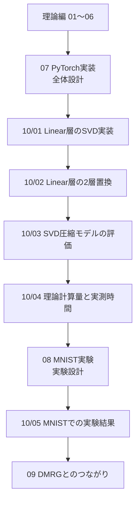
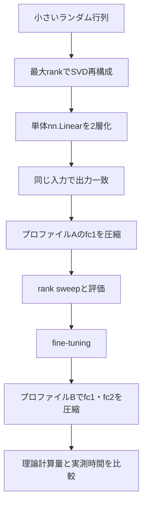

# SVD実装編 目次

## サマリー

このフォルダでは、[[00_基礎理論/07_PyTorch実装]] と [[10_MNIST_MLP_SVD/01_MNIST実験]] で示した全体設計を、実際の作業単位へ分解して整理する。

ルート直下の01〜09は、SVD圧縮の理論、実装全体の見取り図、実験設計、DMRGへの接続を扱う。一方、この実装編では、実際にコードを書くときに必要になる次の内容へ焦点を絞る。

- `nn.Linear` の重みを安全にSVDする
- 上位rankだけを取り出す
- 1つのLinear層を2つのLinear層へ置き換える
- 圧縮前後のモデルを複数段階で評価する
- 理論計算量と実測時間を分けて比較する
- MNIST実験の結果を再現可能な形で記録する



---

## この実装編の位置付け

### ルート直下のノート

ルート直下のノートは、主に「なぜそうなるのか」を扱う。

```text
01〜06
├── SVDの理論
├── nn.Linearの数式
├── 低ランク近似
├── 2層化できる理由
├── rankと圧縮率
└── 誤差評価の定義

07
└── 再利用可能なPyTorch実装の全体像

08
└── MNIST実験の設計と再現手順

09
└── Tensor Train・MPO・DMRGへの接続
```

### 10_SVD実装

このフォルダは「実際にどう組み立て、何を確認するか」を扱う。

```text
10_SVD実装
├── SVD関数の入出力とshape
├── detachとno_gradの使い分け
├── nn.Sequentialによる層置換
├── model.fc1を置き換えたときのModule構造
├── optimizerの作り直し
├── 評価関数の実装方針
├── 理論MACsと実測latency
└── 実験結果の記録
```

同じ数式を最初から再説明するのではなく、理論ノートへリンクしながら実装上の疑問を解決する。

---

## コードの格納方針

コードはMarkdownとは別の `code/` ディレクトリに保存する。  
今回の `code.zip` に実際に含まれていた構成は次のとおりである。

```text
code/
├── 00_pytorch_linear_svd.ipynb
├── 01_linear_low_rank_approximation.ipynb
├── 02_rank_error_compression_tradeoff.ipynb
├── 03_linear_svd_two_layer_replacement.ipynb
├── 04_mnist_mlp_baseline.ipynb
├── 05_mnist_mlp_svd_compression.ipynb
├── 06_mnist_rank_accuracy_tradeoff.ipynb
├── 06_mnist_rank_accuracy_tradeoff/
│   ├── rank_accuracy_tradeoff.png
│   └── retained_energy.png
├── mnist_mlp_baseline.pth
└── regen_notebook_cell_ids.py
```

以前このノートに記載していた、

```text
code/models/
code/compression/
code/evaluation/
code/experiments/
```

というPythonモジュール構成は、実際の `code.zip` には存在しない。  
その構成は将来リファクタリングする場合の案であり、今回の最終ノートでは**実在するNotebookを正本**とする。

### ノートとNotebookの対応

| ノート | 実際の対応コード |
|---|---|
| [[00_基礎理論/08_Linear層のSVD実装]] | `00_pytorch_linear_svd.ipynb`、`01_linear_low_rank_approximation.ipynb`、`02_rank_error_compression_tradeoff.ipynb` |
| [[00_基礎理論/09_Linear層の2層置換_実装]] | `03_linear_svd_two_layer_replacement.ipynb`、`05_mnist_mlp_svd_compression.ipynb`、`06_mnist_rank_accuracy_tradeoff.ipynb` |
| [[00_基礎理論/10_SVD圧縮モデルの評価設計]] | `05_mnist_mlp_svd_compression.ipynb`、`06_mnist_rank_accuracy_tradeoff.ipynb` |
| [[00_基礎理論/11_理論計算量とベンチマーク]] | `05_mnist_mlp_svd_compression.ipynb`、`06_mnist_rank_accuracy_tradeoff.ipynb` |
| [[10_MNIST_MLP_SVD/04_MNISTでの実験結果]] | `04_mnist_mlp_baseline.ipynb`、`05_mnist_mlp_svd_compression.ipynb`、`06_mnist_rank_accuracy_tradeoff.ipynb` |

### 実装済みの主要関数

```text
SVD
RebuildSVD
devidetwolayer
make_one_layer_svd_model
make_two_layer_svd_model
count_parameters
compare_parameters
accuracy_drop
linear_macs
compressed_linear_macs
MACs
benchmark_inference
agreement
logits_rmse
retained_energy
```

> [!warning]
> `devidetwolayer` はNotebook内で実際に使われている綴りである。  
> 英語としては `divide_two_layer` へ改名した方がよいが、ノートでは実コードとの対応を優先して実名を記録する。

### 保存物に関する注意

`04_mnist_mlp_baseline.ipynb` は `mnist_mlp_baseline.pth` を保存する。  
ただし `05` と `06` のNotebookは、そのcheckpointを読み込まず、それぞれ独立にBaselineを学習している。

そのため、Notebook間でaccuracyが少し異なる。  
最終結果を完全再現可能にするには、今後次を追加する必要がある。

- random seedの固定
- 1つのBaseline checkpointの共有
- 実験条件のJSONまたはYAML保存
- rank sweep結果のCSV保存

## 今回の最終実験モデル

実際の `code.zip` で使用したモデルは、次の3層MLPである。

```text
784 → 512 → 256 → 10
```


圧縮対象は `fc1` と `fc2` であり、`fc3` は圧縮しない。

```text
fc1: Linear(784, 512)
fc2: Linear(512, 256)
fc3: Linear(256, 10)
```

ReLUがLinear層の間に入るため、ネットワーク全体を1つの行列へまとめてSVDすることはできない。  
したがって、学習後の `fc1.weight` と `fc2.weight` を個別にSVDし、それぞれを2つのLinear層へ置き換える。

### 実験で完了した内容

- [x] MNIST MLPのBaseline学習
- [x] 学習済みLinear重みへのSVD
- [x] rank 64による `fc1`・`fc2` の2層置換
- [x] パラメータ数の比較
- [x] 理論MACsの比較
- [x] Baselineと圧縮モデルのtest loss・accuracy比較
- [x] 推論時間の比較
- [x] `fc1_rank × fc2_rank` の16条件rank sweep
- [x] 特異値エネルギー保持率
- [x] Baselineとの予測一致率
- [x] logits RMSE

### 今回は実施していない内容

- [ ] SVD後のfine-tuning
- [ ] 複数seedによる平均と標準偏差
- [ ] validation setを使ったrank選択
- [ ] confusion matrix
- [ ] CSVによる結果保存
- [ ] CNN・CIFAR-10への適用

未実施項目は「今後の可能性」であり、今回の実験結果として扱わない。

# ノート一覧

## [[00_基礎理論/08_Linear層のSVD実装]]

### 役割

1つの `nn.Linear` から重みを取り出し、安全にSVDして上位rank成分を得るところまでを扱う。

### 主な内容

- `layer.weight.shape`
- `torch.linalg.svd`
- `full_matrices=False`
- `U`、`S`、`Vh` のshape
- rankの上限
- 最大rankでの再構成
- `detach()` と `torch.no_grad()` の違い
- `.data` を避ける理由
- device・dtype
- 単体テスト

### 対応コード

```text
notebooks/00_fundamentals/00_pytorch_linear_svd.ipynb
notebooks/00_fundamentals/01_linear_low_rank_approximation.ipynb
notebooks/00_fundamentals/02_rank_error_compression_tradeoff.ipynb
```

---

## [[00_基礎理論/09_Linear層の2層置換_実装]]

### 役割

切り詰めSVDで得た因子を2つの `nn.Linear` へ設定し、元の層と置き換える処理を扱う。

### 主な内容

- `first_layer` と `second_layer`
- 中間次元とrank
- biasを後段へ置く理由
- 2層の間へReLUを入れない理由
- `copy_()` と `torch.no_grad()`
- `nn.Sequential` の返り値
- `model.fc1 = ...` でModule構造が変わる仕組み
- device・dtypeの継承
- optimizerを作り直す理由

### 対応コード

```text
notebooks/00_fundamentals/03_linear_svd_two_layer_replacement.ipynb
notebooks/10_mnist_mlp/01_svd_compression.ipynb
notebooks/10_mnist_mlp/02_rank_accuracy_tradeoff.ipynb
```

---

## [[00_基礎理論/10_SVD圧縮モデルの評価設計]]

### 役割

圧縮の良し悪しを、パラメータ数だけでなく、重み・層出力・logits・分類性能の段階に分けて評価する。

### 主な内容

- パラメータ数
- 相対Frobenius誤差
- 層出力RMSE
- logits RMSE
- 予測一致率
- cross-entropy loss
- test accuracy
- confusion matrix
- fine-tuning前後
- 複数seed
- CSV保存形式

### 対応コード

```text
notebooks/10_mnist_mlp/01_svd_compression.ipynb
notebooks/10_mnist_mlp/02_rank_accuracy_tradeoff.ipynb
```

---

## [[00_基礎理論/11_理論計算量とベンチマーク]]

### 役割

理論上のパラメータ削減・乗算回数削減と、実際のlatencyが同じではないことを整理する。

### 主な内容

- パラメータ数
- MACsとFLOPs
- 圧縮成立条件
- `fc1`、`fc2`、`fc3` の具体例
- SVDを行う前処理コスト
- warm-up
- GPU同期
- 平均・中央値
- batch size
- CPU・GPU差
- memory使用量

### 対応コード

```text
notebooks/10_mnist_mlp/01_svd_compression.ipynb
notebooks/10_mnist_mlp/02_rank_accuracy_tradeoff.ipynb
```

---

## [[10_MNIST_MLP_SVD/04_MNISTでの実験結果]]

### 役割

実際に実行した結果だけを記録する。

このノートは実験前の予想を書く場所ではない。未測定の値は空欄または「未測定」と明記する。

### 主な内容

- 実験環境
- baselineの収束確認
- rank sweep
- パラメータ数
- 重み誤差
- 出力誤差
- test loss・accuracy
- fine-tuning後accuracy
- latency
- confusion matrix
- 特異値スペクトル
- 考察

### 対応コード

```text
notebooks/10_mnist_mlp/02_rank_accuracy_tradeoff.ipynb
```

---

# 実装の推奨順序



---

## 各段階の完了条件

### 1. SVD単体

- [ ] 最大rankで元行列を再構成できる
- [ ] rankを下げると相対誤差が増える
- [ ] `U_r`、`S_r`、`Vh_r` のshapeを説明できる
- [ ] rank上限を検査できる

### 2. Linear層の置換

- [ ] 元Linearと2層Linearの出力が最大rankで一致する
- [ ] biasを後段だけへコピーできる
- [ ] 2層間に活性化関数がない
- [ ] deviceとdtypeが一致する
- [ ] 置換後にoptimizerを作り直している

### 3. 評価

- [ ] パラメータ数を比較できる
- [ ] 重み誤差とタスク誤差を区別できる
- [ ] 圧縮直後とfine-tuning後を分けて記録できる
- [ ] test setをrank選択へ使っていない

### 4. 速度

- [ ] 理論MACsを計算できる
- [ ] warm-up後に複数回測定している
- [ ] CUDA使用時に同期している
- [ ] 平均だけでなく中央値も記録している

### 5. 実験結果

- [ ] 実測値だけを書いている
- [ ] seed、device、バージョンを記録している
- [ ] baselineのcheckpointを固定している
- [ ] rankごとの結果をCSVへ保存している

---

# この実装編で特に解決する疑問

- `layer.weight.detach()` と `with torch.no_grad()` は何が違うのか
- なぜSVD計算では `detach()` を使い、重みコピーでは `no_grad()` を使うのか
- `model.fc1 = DivideTwoLayer(model.fc1, 64)` とすると、なぜモデルとして動くのか
- 元の `fc1` は `first_layer` と `second_layer` を持っていないのに、置換後はなぜ2層になるのか
- 中間次元とrankは同じなのか
- rankにはどのような上限があるのか
- `fc3` のrankが10を超えられないのはなぜか
- パラメータ数が減れば必ず推論が速くなるのか
- SVD自体の計算コストと、圧縮後の推論コストはどちらを測るべきか
- accuracy以外に何を評価するべきか

---

# 関連ノート

## 理論

- [[00_基礎理論/01_SVDとは]]
- [[00_基礎理論/02_nn.Linearとは]]
- [[00_基礎理論/03_SVDによる低ランク近似]]
- [[00_基礎理論/04_Linear層を2層へ置き換える]]
- [[00_基礎理論/05_圧縮率とRank]]
- [[00_基礎理論/06_誤差評価]]

## 全体設計・実験

- [[00_基礎理論/07_PyTorch実装]]
- [[10_MNIST_MLP_SVD/01_MNIST実験]]

## 発展

- [[50_DMRG/01_SVDからDMRGへのつながり]]


## PDF反映監査

- [[90_監査/PDF内容反映監査]]
