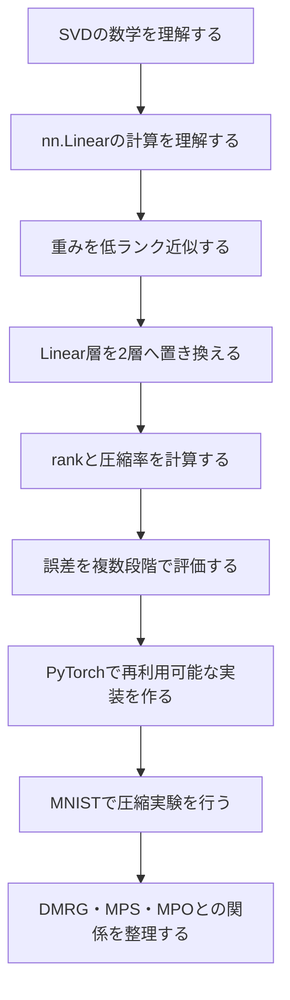
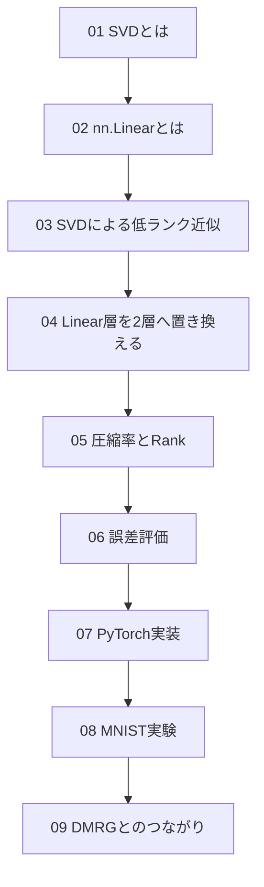
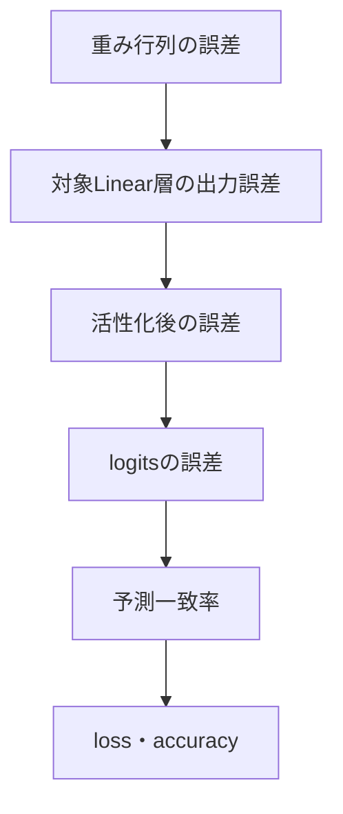
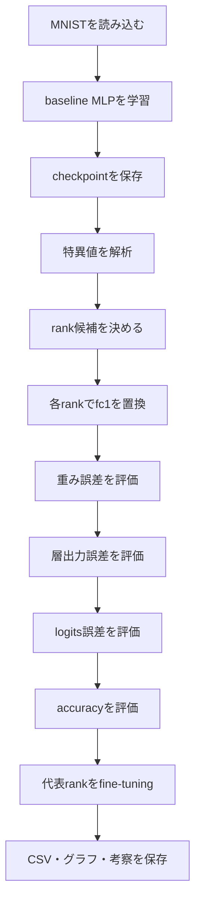
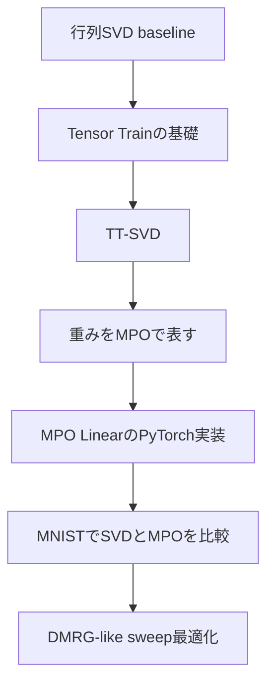

# NN圧縮とSVDノート 目次

## サマリー

このノート群では、ニューラルネットワークの学習済み重み行列へSVDを適用し、Linear層を低ランク化する方法を、数学・実装・実験の順に体系的に学ぶ。

中心となる対象は、PyTorchの

```python
nn.Linear
```

である。

元の重み行列

$$
W
\in
\mathbb{R}^{
D_{\mathrm{out}}
\times
D_{\mathrm{in}}
}
$$

をSVDし、上位rankだけを残す。

$$
W
=
U\Sigma V^{\mathsf{T}}
$$

$$
W_r
=
U_r\Sigma_rV_r^{\mathsf{T}}
$$

この低ランク近似を、2つの小さいLinear層として実装する。

```text
元の層

D_in ───────────────▶ D_out
       Linear(W, b)
```

```text
圧縮後

D_in ─▶ rank r ─▶ D_out
        Linear     Linear
        biasなし    元のbias
```

最終的には、MNISTを使って次を比較する。

- rank
- パラメータ数
- 圧縮率
- 特異値エネルギー保持率
- 重み近似誤差
- 層出力誤差
- logits誤差
- test accuracy
- fine-tuning後のaccuracy
- 実測推論時間

最後に、行列SVDによる圧縮を、MPS・Tensor Train・MPO・DMRG-like最適化へつなげる。

---

## このノート群の目的

このノート群の目的は、単にSVDのコードを動かすことではない。

次の流れを、自分で説明・実装・評価できる状態を目指す。



---

## 到達目標

このノート群を一通り終えた時点で、次をできることを目標とする。

- SVDの式と各行列の役割を説明できる
- 特異値とrankの意味を説明できる
- 切り詰めSVDが最良低ランク近似になる理由を説明できる
- `nn.Linear` の重み形状と行列積を説明できる
- 学習済みLinear層を2つの小さいLinear層へ置き換えられる
- 2層の間にReLUを入れてはいけない理由を説明できる
- rankごとのパラメータ数と圧縮成立条件を計算できる
- 重み誤差・層出力誤差・タスク誤差を区別できる
- PyTorchで再利用可能な低ランクLinearを実装できる
- MNISTでbaselineと圧縮モデルを公平に比較できる
- 圧縮直後とfine-tuning後の性能を分けて評価できる
- 行列rankとMPSのbond dimensionの共通点と違いを説明できる
- NN重みの特異値をSchmidt係数やエネルギーと混同せず説明できる
- Tensor Train・MPO・DMRG-like手法へ進むための前提を理解できる

---

# 全体ロードマップ

## 01〜09の依存関係



基本的には、[[01_SVDとは]] から [[09_DMRGとのつながり]] まで順番に読む。

---

## 学習段階

```text
第1段階：数学
├── 01_SVDとは
└── 03_SVDによる低ランク近似

第2段階：ニューラルネットワークの構造
├── 02_nn.Linearとは
└── 04_Linear層を2層へ置き換える

第3段階：圧縮設計と評価
├── 05_圧縮率とRank
└── 06_誤差評価

第4段階：実装と実験
├── 07_PyTorch実装
└── 08_MNIST実験

第5段階：テンソルネットワークへの接続
└── 09_DMRGとのつながり
```

---

# ノート一覧

## [[01_SVDとは]]

### 役割

SVDによるNN圧縮を理解するための線形代数の基礎を作る。

### 主な内容

- 任意の実行列に対するSVD
- $U$、$\Sigma$、$V^{\mathsf{T}}$ の役割
- 特異値と特異ベクトル
- 行列のrank
- ランク1行列の和としてのSVD
- 切り詰めSVD
- Eckart–Young–Mirskyの定理
- フロベニウスノルム誤差
- 特異値エネルギー
- NumPy・PyTorchによるSVD
- 特異値スペクトルの可視化
- NN圧縮との接点

### この章で答えられるようになる問い

- SVDは何を分解しているのか
- 特異値が大きいとはどういう意味か
- 小さい特異値を捨てると、なぜ近似になるのか
- 固有値分解とSVDは何が違うのか
- 長方形行列にもSVDを使えるのはなぜか

### 次に進む条件

次を説明できれば [[02_nn.Linearとは]] へ進む。

$$
W
=
U\Sigma V^{\mathsf{T}}
$$

$$
W_r
=
U_r\Sigma_rV_r^{\mathsf{T}}
$$

---

## [[02_nn.Linearとは]]

### 役割

SVDを適用する対象であるPyTorchのLinear層を、数式・形状・実装の面から理解する。

### 主な内容

- `nn.Linear` の基本
- 線形変換とアフィン変換
- 重み行列とbias
- 重み形状
- バッチ入力
- 3次元以上の入力
- biasのブロードキャスト
- `torch.nn.functional.linear`
- 学習可能パラメータ
- パラメータ数と計算量
- 活性化関数との区別
- Linear層だけを重ねた場合
- 学習済み重みの取得
- SVDを適用する対象
- MNISTでのLinear層
- 最大rankと実rank
- よくある形状エラー

### 中心となる式

PyTorchの重みを、

$$
W
\in
\mathbb{R}^{
D_{\mathrm{out}}
\times
D_{\mathrm{in}}
}
$$

とすると、1サンプルの出力は、

$$
y
=
Wx+b
$$

である。

バッチ入力では、PyTorch上の表記は、

$$
Y
=
XW^{\mathsf{T}}+b
$$

となる。

### 次に進む条件

次を迷わず答えられれば [[03_SVDによる低ランク近似]] へ進む。

- `nn.Linear(784, 512)` の重み形状
- biasの形状
- 入力バッチの形状
- 出力バッチの形状
- SVDを適用するテンソル

---

## [[03_SVDによる低ランク近似]]

### 役割

SVDを使って、学習済み重み行列を少ないrankで近似する理論を整理する。

### 主な内容

- 低ランク行列
- 2つの小さい行列への分解
- ランク1行列の和
- 切り詰めSVD
- 大きい特異値を残す理由
- 最良低ランク近似
- フロベニウスノルム誤差
- スペクトルノルム誤差
- 特異値エネルギー保持率
- 厳密な低ランクと近似的な低ランク
- 重み誤差・出力誤差・タスク誤差の違い
- 入力分布を考慮した誤差
- NN重みで低ランク構造を期待する理由
- パラメータ圧縮が成立する条件
- rank選択方法
- PyTorchによる低ランク近似
- 理論誤差と実測誤差の比較
- fine-tuningの意味

### 中心となる式

$$
W_r
=
U_r\Sigma_rV_r^{\mathsf{T}}
$$

$$
\lVert
W-W_r
\rVert_F^2
=
\sum_{i=r+1}^{k}
\sigma_i^2
$$

$$
E(r)
=
\frac{
\sum_{i=1}^{r}
\sigma_i^2
}{
\sum_{i=1}^{k}
\sigma_i^2
}
$$

### 重要な区別

```text
重み誤差
W と W_r の差
        ↓
層出力誤差
Wx と W_rx の差
        ↓
モデル出力誤差
logitsの差
        ↓
タスク誤差
loss・accuracyの変化
```

### 次に進む条件

- 最大rankでは元の行列へ戻る
- rankを下げると誤差が増える
- 重み誤差が小さくてもaccuracyが同じとは限らない

この3点を説明できれば [[04_Linear層を2層へ置き換える]] へ進む。

---

## [[04_Linear層を2層へ置き換える]]

### 役割

低ランク近似した重みを、実際のPyTorchモデルで動作する2つのLinear層へ変換する。

### 主な内容

- 元のLinear層
- SVDによる低ランク近似
- $\Sigma_r$ を前段へ吸収する方法
- $\Sigma_r$ を後段へ吸収する方法
- $\Sigma_r^{1/2}$ を左右へ分配する方法
- 2つのLinear層への変換
- biasの配置
- 2層の間にReLUを入れない理由
- 元から存在するReLUを残す方法
- PyTorchの `Vh`
- 最大rankでの再構成確認
- 再構成重みの確認
- モデル内の層置換
- `nn.Sequential` での扱い
- optimizer再作成
- 保存・読み込み
- fine-tuning

### 中心となる構造

$$
W_r
=
BA
$$

$$
A
\in
\mathbb{R}^{
r
\times
D_{\mathrm{in}}
}
$$

$$
B
\in
\mathbb{R}^{
D_{\mathrm{out}}
\times
r
}
$$

```text
正しい置換

入力
 ↓
Linear(D_in, r, bias=False)
 ↓
Linear(r, D_out, bias=True)
 ↓
元から存在していた活性化関数
```

### 最重要注意

SVDで分解した2つのLinear層の間にReLUを入れない。

```text
誤り

Linear(D_in, r)
 ↓
ReLU
 ↓
Linear(r, D_out)
```

これは元のLinear層の低ランク近似ではなく、新しい非線形ネットワークになる。

### 次に進む条件

- `Vh` をそのまま前段重みに使える理由
- 元のbiasを後段へ置く理由
- 最大rankで元出力を再現する確認方法

を説明できれば [[05_圧縮率とRank]] へ進む。

---

## [[05_圧縮率とRank]]

### 役割

rankを変えたときに、どの程度パラメータ数・保存容量・理論演算量が変わるかを計算する。

### 主な内容

- rankの範囲
- 元のLinear層のパラメータ数
- 低ランク2層のパラメータ数
- 圧縮成立条件
- 損益分岐rank
- 保持率・削減率・圧縮倍率
- `Linear(784, 512)` のrank別比較
- 小さいLinear層を圧縮する場合
- モデル全体の圧縮率
- 保存容量
- optimizer state
- MACsとFLOPs
- 中間テンソル
- 理論計算量と実測時間の違い
- 特異値エネルギーとrank
- rank選択方法

### 中心となる式

元の重み数は、

$$
P_{\mathrm{original}}
=
D_{\mathrm{out}}D_{\mathrm{in}}
$$

低ランク化後は、

$$
P_{\mathrm{lowrank}}
=
r
\left(
D_{\mathrm{in}}
+
D_{\mathrm{out}}
\right)
$$

圧縮が成立する条件は、

$$
r
<
\frac{
D_{\mathrm{in}}D_{\mathrm{out}}
}{
D_{\mathrm{in}}+D_{\mathrm{out}}
}
$$

である。

### `Linear(784, 512)` の基準値

元の重みパラメータ数：

$$
784
\times
512
=
401{,}408
$$

rank 64の場合：

$$
64
\times
(784+512)
=
82{,}944
$$

### 次に進む条件

- rankだけでは圧縮率が決まらず、入出力次元も必要
- パラメータ数が減っても推論時間が同じ割合で減るとは限らない
- 層単体とモデル全体の圧縮率を区別する

を説明できれば [[06_誤差評価]] へ進む。

---

## [[06_誤差評価]]

### 役割

圧縮による変化を、1つのaccuracyだけで判断せず、複数段階の指標で評価する。

### 主な内容

- 差分
- MAE
- MSE
- RMSE
- 最大絶対誤差
- フロベニウスノルム
- 相対誤差
- 相対RMSE
- コサイン類似度
- 重み行列の誤差
- SVD理論誤差
- スペクトルノルム誤差
- Linear層の出力誤差
- 入力分布を考慮した期待誤差
- ReLU前後の誤差
- 活性状態の一致率
- logits誤差
- 予測margin
- 予測一致率
- Cross Entropy Loss
- accuracy
- fine-tuning前後の比較

### 評価階層



### 重要な注意

差分をそのまま平均すると、正負が打ち消し合う。

```python
mean_error = torch.mean(
    reference
    -
    approximation
)
```

これは、近似の大きさを測る主指標には向かない。

MSEでは、差を二乗する。

```python
mse = torch.mean(
    (
        reference
        -
        approximation
    )
    ** 2
)
```

### 次に進む条件

- MSEとRMSEの違い
- フロベニウス誤差と相対誤差の違い
- 重み誤差とaccuracyが一致しない理由
- データセット全体のRMSEを正しく集計する方法

を理解したら [[07_PyTorch実装]] へ進む。

---

## [[07_PyTorch実装]]

### 役割

01〜06で整理した理論を、再利用可能なPyTorchコードへまとめる。

### 主な内容

- rank検証
- 圧縮統計
- 切り詰めSVD
- 因子重みの作成
- 特異値の配置方法
- `LowRankLinear`
- 学習済みLinearからの変換
- biasの引き継ぎ
- 再構成重み
- 最大rankテスト
- 重み・出力誤差評価
- 特異値エネルギー
- モデル内の層取得・置換
- `nn.Sequential` 内の置換
- optimizer再作成
- device・dtype・train/evalモード
- `detach()`、`no_grad()`、`inference_mode()`
- ベンチマーク
- checkpoint保存・読み込み
- rank sweep
- 自動テスト
- Notebookとプロジェクト構成

### 中心となる実装部品

- `LowRankLinear`
- `compression_stats`
- `truncated_svd`
- `factor_weights`
- `compare_tensors`
- `compare_weight_matrices`
- `compress_linear_by_path`
- `benchmark_module`
- `rank_for_energy`

### 実装上の最重要確認

```text
最大rank
  ↓
再構成重みが元重みに近い
  ↓
同じ入力に対する出力が近い
  ↓
rankを下げた実験へ進む
```

最大rankで一致しない場合は、rank sweepやMNIST実験へ進まない。

### 次に進む条件

- 1層を安全に置換できる
- 最大rankテストが通る
- optimizerを置換後に作り直せる
- checkpointを保存・読み込みできる

状態になったら [[08_MNIST実験]] へ進む。

---

## [[08_MNIST実験]]

### 役割

学習済みMNIST MLPへSVD圧縮を適用し、rankと圧縮率・誤差・分類精度の関係を実験する。

### 対象モデル

```text
入力画像
(N, 1, 28, 28)
      │
      ▼
Flatten
(N, 784)
      │
      ▼
Linear(784, 512)
      │
      ▼
ReLU
      │
      ▼
Linear(512, 10)
      │
      ▼
logits
(N, 10)
```

最初の圧縮対象は、

```python
nn.Linear(
    784,
    512,
)
```

である。

### 主な内容

- MNISTの読み込み
- train・validation・testの分離
- seed・device・保存先
- baseline MLP
- 学習・評価関数
- baseline checkpoint
- 圧縮対象層の確認
- 特異値スペクトル
- 累積エネルギー
- エネルギー閾値rank
- rank候補
- 最大rankでの実装確認
- データセット全体の誤差集計
- 重み誤差
- 層出力誤差
- logits誤差
- 予測一致率
- rank sweep
- DataFrame・CSV保存
- グラフ作成
- fine-tuning
- 推論時間
- クラス別accuracy
- 誤分類画像
- 実験メタデータ
- 考察・結論の書き方

### 基本rank候補

$$
r
\in
\{
8,
16,
32,
64,
128,
256
\}
$$

### 実験の原則

```text
1つの学習済みbaseline
├── rank 8
├── rank 16
├── rank 32
├── rank 64
├── rank 128
└── rank 256
```

rankごとにbaselineを再学習しない。

### 最低限保存する結果

- baseline test loss
- baseline test accuracy
- rank
- パラメータ数
- 重み保持率
- 圧縮倍率
- 特異値エネルギー保持率
- 相対重み誤差
- 層出力RMSE
- logits RMSE
- 予測一致率
- 圧縮直後accuracy
- fine-tuning後accuracy
- 推論時間

### 実験完了条件

- baseline checkpointを保存した
- 特異値スペクトルを描いた
- 最大rankで再構成を確認した
- 複数rankを評価した
- CSVへ結果を保存した
- 代表rankをfine-tuningした
- 圧縮率とaccuracyのグラフを作った
- 結果を文章で考察した

### 次に進む条件

単純SVDによるMNIST baselineを完成させた後、[[09_DMRGとのつながり]] へ進む。

---

## [[09_DMRGとのつながり]]

### 役割

行列SVDによるNN圧縮と、MPS・Tensor Train・MPO・DMRGの共通点と違いを整理する。

### 主な内容

- DMRG
- MPS
- bond dimension
- Schmidt分解
- 密度行列
- discarded weight
- NN特異値エネルギーとの数式上の対応
- rankとbond dimension
- 2因子Linearを最小のテンソルネットワークとして見る考え方
- MPO
- Tensor Train
- 行列SVDとMPOの違い
- DMRGのsweep
- 2-site DMRG
- canonical form
- gauge freedom
- ALS
- TT-SVD
- tensorization
- DMRG-likeなNN局所最適化
- HamiltonianとNN lossの違い
- 行列SVDをbaselineにする理由
- 将来の研究ロードマップ

### 最重要の共通点

- SVDを使う
- 上位特異値を残す
- 内部次元を制限する
- 捨てた特異値の二乗和を誤差指標にする
- 小さいテンソルの積へ分解する

### 最重要の違い

- NN圧縮は主に重み行列を近似する
- DMRGは量子状態を変分的に最適化する
- DMRGはHamiltonianとエネルギー最小化を扱う
- DMRGの特異値はSchmidt係数として解釈できる
- NN重みの特異値は、通常はSchmidt係数ではない
- NN重みの特異値はエネルギー固有値ではない

### 次の発展先

- [[10_Tensor Trainとは]]
- [[11_TT-SVD]]
- [[12_MPOでLinear層を表す]]
- [[13_MPOのPyTorch実装]]
- [[14_MPOによるMNIST圧縮]]
- [[15_DMRG-like最適化]]

これらは今後追加する発展ノートの候補である。

---

# 目的別の読み方

## 数学から順番に理解したい

```text
01 → 03 → 02 → 04 → 05 → 06 → 07 → 08 → 09
```

SVDと近似理論を先に固め、その後Linear層へ接続する。

---

## 実装を早く動かしたい

```text
02 → 04 → 07 → 08
       ↑
    01・03・05・06を必要に応じて参照
```

ただし、最大rankでの一致確認と誤差評価は省略しない。

---

## 研究テーマ全体を把握したい

```text
00 → 08 → 09 → 01〜07
```

最初に実験の全体像と将来の発展先を見た後、理論へ戻る。

---

## DMRG経験からNN圧縮へ入りたい

```text
09 → 01 → 03 → 04 → 07 → 08
```

ただし、量子状態のSchmidt係数とNN重みの特異値を同一視しない。

---

# 理論・実装・実験の対応表

| 理論・概念 | 実装箇所 | 実験で確認するもの |
|---|---|---|
| SVD | `torch.linalg.svd` | 特異値スペクトル |
| 切り詰めSVD | `truncated_svd` | rank別重み誤差 |
| 特異値エネルギー | `rank_for_energy` | 累積エネルギー |
| 低ランク因子 | `factor_weights` | 最大rankでの再構成 |
| 2層Linear | `LowRankLinear` | 元層との出力比較 |
| 圧縮率 | `compression_stats` | rank別パラメータ数 |
| 重み誤差 | `compare_weight_matrices` | 相対フロベニウス誤差 |
| 出力誤差 | `compare_tensors` | 層出力RMSE |
| モデル置換 | `compress_linear_by_path` | MNIST圧縮モデル |
| 推論時間 | `benchmark_module` | baselineとの時間比較 |
| タスク性能 | 学習・評価関数 | loss・accuracy |
| 再最適化 | fine-tuning | 精度回復量 |

---

# 実験フロー



---

# 重要なチェックポイント

## 数学

- [ ] $W=U\Sigma V^{\mathsf{T}}$ の各行列の形状を説明できる
- [ ] 特異値が大きい順に並ぶことを理解している
- [ ] rankと非ゼロ特異値数の関係を説明できる
- [ ] 切り詰めSVDの誤差式を説明できる
- [ ] 特異値エネルギー保持率を計算できる

## Linear層

- [ ] `nn.Linear(in_features, out_features)` の重み形状を説明できる
- [ ] bias込みではアフィン変換であることを理解している
- [ ] PyTorchのバッチ行列積の向きを理解している
- [ ] Linearと活性化関数を区別できる

## 低ランク置換

- [ ] 2つのLinearの間にReLUを入れない
- [ ] 元のbiasを後段へ引き継ぐ
- [ ] 入出力形状を変えない
- [ ] 最大rankで元重み・元出力に近づくことを確認する
- [ ] 置換後にoptimizerを作り直す

## 評価

- [ ] 重み誤差とaccuracyを区別する
- [ ] MAE・MSE・RMSEを区別する
- [ ] 相対誤差の分母を確認する
- [ ] バッチRMSEを単純平均しない
- [ ] 圧縮直後とfine-tuning後を分けて記録する
- [ ] パラメータ数と実測時間を分けて評価する

## 実験

- [ ] rankごとにbaselineを再学習しない
- [ ] validationとtestの用途を区別する
- [ ] seed・device・ライブラリバージョンを保存する
- [ ] checkpointとCSVを保存する
- [ ] 特異値スペクトルとaccuracy曲線を描く
- [ ] 結果の限界を文章で明記する

## DMRGとの接続

- [ ] DMRGはSVDだけではないと説明できる
- [ ] rankとbond dimensionの類似点を説明できる
- [ ] NN特異値とSchmidt係数を混同しない
- [ ] HamiltonianとNN lossの違いを説明できる
- [ ] TT-SVD・MPO・DMRG-likeの段階を区別できる

---

# よくある混同

## SVD圧縮とpruning

SVD圧縮は、重み要素を個別に0へする方法ではない。

```text
SVD圧縮
大きな行列を2つの小さい行列へ分解する
```

```text
pruning
重み要素・チャネル・ユニットなどを削除する
```

---

## rankと圧縮率

同じrankでも、入出力次元が異なれば圧縮率は異なる。

$$
P_{\mathrm{lowrank}}
=
r
\left(
D_{\mathrm{in}}
+
D_{\mathrm{out}}
\right)
$$

を使って計算する。

---

## 特異値エネルギーとaccuracy

エネルギー保持率が99%でも、accuracyが99%維持される保証はない。

SVDが最小化するのは重み行列のノルム誤差であり、分類lossではない。

---

## 2層化と非線形化

SVDによる2層化では、2つのLinearの間に活性化関数を入れない。

元モデルでLinearの後に存在したReLUは、そのまま残す。

---

## パラメータ削減と高速化

パラメータ数や理論MAC数が減っても、実測推論時間が同じ割合で短くなるとは限らない。

2つのLinearへ分かれることで、演算呼び出しや中間テンソルのオーバーヘッドが発生する。

---

## SVDとDMRG

DMRGはSVDの別名ではない。

DMRGには、MPSによる状態表現、局所有効問題、変分更新、sweep、SVD切り捨てが含まれる。

---

# 推奨プロジェクト構成

```text
nn-svd-experiment/
├── notebooks/
│   └── 08_mnist_svd_experiment.ipynb
├── src/
│   ├── models.py
│   ├── svd_compression.py
│   ├── metrics.py
│   └── training.py
├── checkpoints/
│   ├── mnist_mlp_baseline.pt
│   └── mnist_mlp_rank64_finetuned.pt
├── results/
│   ├── rank_results_before_finetuning.csv
│   ├── rank_results_with_finetuning.csv
│   ├── experiment_metadata.json
│   └── figures/
├── notes/
│   ├── 00_目次.md
│   ├── 01_SVDとは.md
│   ├── 02_nn.Linearとは.md
│   ├── 03_SVDによる低ランク近似.md
│   ├── 04_Linear層を2層へ置き換える.md
│   ├── 05_圧縮率とRank.md
│   ├── 06_誤差評価.md
│   ├── 07_PyTorch実装.md
│   ├── 08_MNIST実験.md
│   └── 09_DMRGとのつながり.md
└── README.md
```

---

# 学習記録テンプレート

各章を進めるときは、次を記録する。

```markdown
## 学習日

YYYY-MM-DD

## 理解できたこと

-

## まだ曖昧なこと

-

## 実行したコード

-

## 発生したエラー

-

## 自分の言葉での説明

-

## 次に確認すること

-
```

---

# 実験記録テンプレート

```markdown
## 実験名

## 仮説

## baseline

- seed:
- epoch:
- learning rate:
- test loss:
- test accuracy:

## 圧縮条件

- target layer:
- rank:
- singular-value placement:
- fine-tuning epoch:
- fine-tuning learning rate:

## 結果

- parameter count:
- keep ratio:
- compression factor:
- retained energy:
- relative weight error:
- layer output RMSE:
- logits RMSE:
- prediction agreement:
- test accuracy before fine-tuning:
- test accuracy after fine-tuning:
- inference time:

## 考察

## 次の実験
```

---

# 研究ロードマップ

## 現在の範囲

```text
行列SVD
  ↓
Linear層の2因子化
  ↓
MNISTでrank比較
  ↓
fine-tuning
```

## 次の範囲



## 今後の候補ノート

- [[10_Tensor Trainとは]]
- [[11_TT-SVD]]
- [[12_MPOでLinear層を表す]]
- [[13_MPOのPyTorch実装]]
- [[14_MPOによるMNIST圧縮]]
- [[15_DMRG-like最適化]]

---

# 研究で比較する基準

将来、MPOやDMRG-like手法を実装した場合、単純SVDを必ずbaselineとして残す。

比較方法は、次の2種類を基本とする。

## 同じパラメータ数で比較する

$$
P_{\mathrm{SVD}}
\approx
P_{\mathrm{MPO}}
$$

の条件で、accuracyやlossを比較する。

## 同じaccuracyで比較する

同程度のaccuracyを保つために必要なパラメータ数・学習時間・推論時間を比較する。

## 併記する項目

- 圧縮直後かfine-tuning後か
- optimizer
- learning rate
- epoch数
- seed
- tensorization
- rankまたはbond dimension
- パラメータ数
- 学習時間
- 推論時間
- device

---

# このノート群の完了条件

## 理論

- [ ] SVDを行列の形状込みで説明できる
- [ ] 切り詰めSVDの誤差式を説明できる
- [ ] rankと圧縮率の関係を計算できる
- [ ] 重み誤差・出力誤差・タスク誤差を区別できる

## 実装

- [ ] `LowRankLinear` を自力で再実装できる
- [ ] 任意のLinear層を名前で置換できる
- [ ] 最大rankテストを作れる
- [ ] 圧縮モデルを保存・読み込みできる

## 実験

- [ ] MNIST baselineを学習できる
- [ ] rank sweepを実行できる
- [ ] CSVとグラフを保存できる
- [ ] fine-tuning前後を比較できる
- [ ] 結果を数値入りで考察できる

## 発展

- [ ] SVDとSchmidt分解の関係を説明できる
- [ ] rankとbond dimensionの違いを説明できる
- [ ] 行列SVDとMPO分解の違いを説明できる
- [ ] DMRG-likeという表現が必要な理由を説明できる

---

# 用語の最小整理

| 用語 | このノート群での意味 |
|---|---|
| SVD | 行列を左右の特異ベクトルと特異値へ分解する方法 |
| 特異値 | 各変換方向の強さを表す非負の値 |
| rank | 独立な変換方向の数 |
| 切り詰めSVD | 上位rankの特異値・特異ベクトルだけを残す近似 |
| 低ランク近似 | 元行列をより小さいrankの行列で近似すること |
| 保持率 | 圧縮後に残るパラメータ数の割合 |
| 削減率 | 圧縮によって減ったパラメータ数の割合 |
| 圧縮倍率 | 元のパラメータ数を圧縮後で割った値 |
| RMSE | 誤差二乗平均の平方根 |
| fine-tuning | 圧縮後モデルをタスクlossで再学習すること |
| MPS | 量子状態・高階テンソルを行列積形式で表す表現 |
| Tensor Train | MPSと基本構造が近い高階テンソル分解 |
| MPO | 行列・演算子をテンソル列で表す形式 |
| bond dimension | テンソル間の内部添字次元 |
| DMRG | MPSを局所的に変分最適化するsweep型手法 |
| DMRG-like | DMRGの局所更新・sweep・SVD再分割を参考にした手法 |

---

# 関連ノート

## 基礎

- [[01_SVDとは]]
- [[02_nn.Linearとは]]
- [[03_SVDによる低ランク近似]]

## 圧縮設計

- [[04_Linear層を2層へ置き換える]]
- [[05_圧縮率とRank]]
- [[06_誤差評価]]

## 実装・実験

- [[07_PyTorch実装]]
- [[08_MNIST実験]]

## 発展

- [[09_DMRGとのつながり]]
- [[10_Tensor Trainとは]]
- [[11_TT-SVD]]
- [[12_MPOでLinear層を表す]]

---

# 最初に読むノート

初めて読む場合は、[[01_SVDとは]] から開始する。

すでにSVDの基礎を理解している場合は、[[02_nn.Linearとは]] でPyTorchの重み形状を確認し、[[03_SVDによる低ランク近似]] へ進む。

実装を進める場合は、[[07_PyTorch実装]] を参照しながら、[[08_MNIST実験]] のNotebookを作成する。
