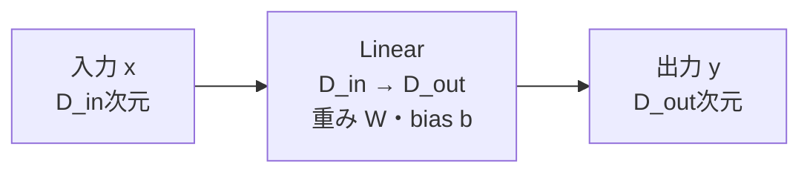
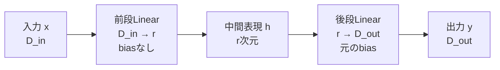
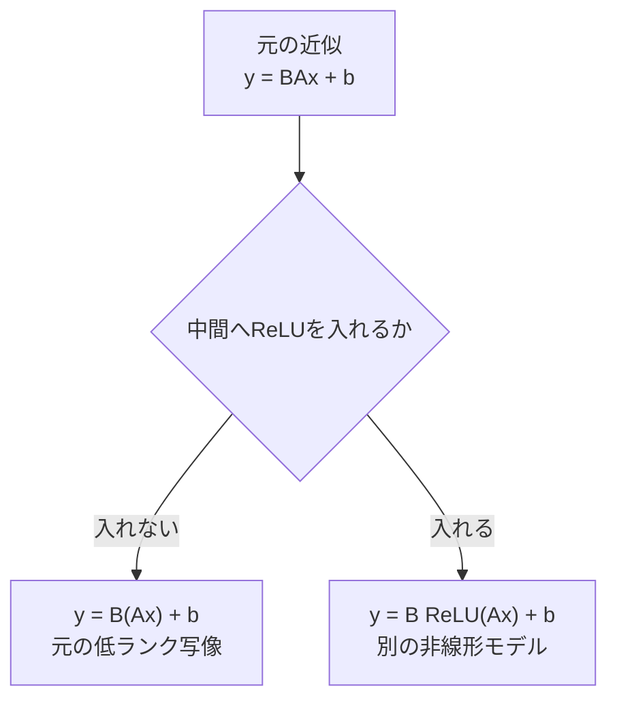
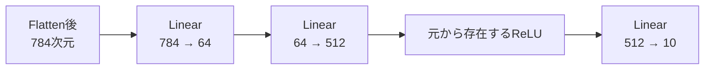
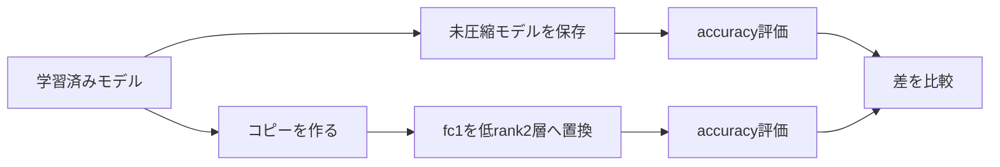
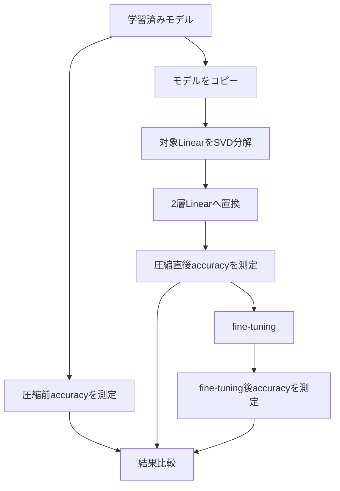

# Linear層を2層へ置き換える

## サマリー

SVDで低ランク近似した重み行列

$$
W_r
=
U_r\Sigma_rV_r^{\mathsf{T}}
$$

は、2つの小さい行列の積として表せる。

$$
W_r=BA
$$

そのため、元の1つのLinear層

$$
y=Wx+b
$$

を、rank $r$ を中間次元とする2つのLinear層へ置き換えられる。

$$
h=Ax
$$

$$
y=Bh+b
$$

したがって、

$$
y=BAx+b
=
W_rx+b
$$

となる。

PyTorchでは、次の構造に対応する。

```python
nn.Sequential(
    nn.Linear(
        in_features=D_in,
        out_features=rank,
        bias=False,
    ),
    nn.Linear(
        in_features=rank,
        out_features=D_out,
        bias=True,
    ),
)
```

重要なのは、2層の間へReLUなどの非線形関数を挟まないことである。

```text
正しい低ランク置換

Linear(D_in, rank)
        ↓
Linear(rank, D_out)
```

```text
元のLinear層の近似ではない構造

Linear(D_in, rank)
        ↓
ReLU
        ↓
Linear(rank, D_out)
```

SVDによる2層化の目的は、表現力を増やすことではない。

- 元の重み行列を低ランク近似する
- パラメータ数を減らす
- 理論上の演算量を減らす
- 入出力形状を保つ

ことが目的である。

---

## 1. 元のLinear層

入力次元を $D_{\mathrm{in}}$、出力次元を $D_{\mathrm{out}}$ とする。

元の重み行列は、

$$
W
\in
\mathbb{R}^{
D_{\mathrm{out}}
\times
D_{\mathrm{in}}
}
$$

である。

biasは、

$$
b
\in
\mathbb{R}^{D_{\mathrm{out}}}
$$

である。

1サンプルを列ベクトルで表すと、

$$
x
\in
\mathbb{R}^{D_{\mathrm{in}}}
$$

$$
y
\in
\mathbb{R}^{D_{\mathrm{out}}}
$$

であり、Linear層は、

$$
y=Wx+b
$$

を計算する。

### ASCII図

```text
入力 x
D_in 次元
   │
   ▼
Linear(D_in, D_out)
重み W
bias b
   │
   ▼
出力 y
D_out 次元
```

### Mermaid図



---

## 2. SVDによる低ランク近似

学習済み重み行列 $W$ をSVDする。

$$
W
=
U\Sigma V^{\mathsf{T}}
$$

上位 $r$ 個の特異値だけを残す。

$$
W_r
=
U_r\Sigma_rV_r^{\mathsf{T}}
$$

各行列の形状は、

$$
U_r
\in
\mathbb{R}^{
D_{\mathrm{out}}
\times
r
}
$$

$$
\Sigma_r
\in
\mathbb{R}^{r\times r}
$$

$$
V_r^{\mathsf{T}}
\in
\mathbb{R}^{
r
\times
D_{\mathrm{in}}
}
$$

である。

行列積の形状は、

$$
(D_{\mathrm{out}}\times r)
(r\times r)
(r\times D_{\mathrm{in}})
=
D_{\mathrm{out}}
\times
D_{\mathrm{in}}
$$

となり、元の重み行列と同じ形状へ戻る。

ただし、

$$
\operatorname{rank}(W_r)
\leq r
$$

である。

---

## 3. $\Sigma_r$ を前段へ吸収する方法

次のように定義する。

$$
A
=
\Sigma_rV_r^{\mathsf{T}}
$$

$$
B
=
U_r
$$

すると、

$$
BA
=
U_r
\left(
\Sigma_rV_r^{\mathsf{T}}
\right)
$$

$$
BA
=
U_r\Sigma_rV_r^{\mathsf{T}}
$$

したがって、

$$
BA=W_r
$$

である。

形状は、

$$
A
\in
\mathbb{R}^{
r
\times
D_{\mathrm{in}}
}
$$

$$
B
\in
\mathbb{R}^{
D_{\mathrm{out}}
\times
r
}
$$

である。

### 2つのLinear層への対応

前段：

```python
nn.Linear(
    in_features=D_in,
    out_features=rank,
    bias=False,
)
```

後段：

```python
nn.Linear(
    in_features=rank,
    out_features=D_out,
    bias=True,
)
```

重みは、

```text
前段.weight = Σ_r V_rᵀ
後段.weight = U_r
```

となる。

---

## 4. $\Sigma_r$ を後段へ吸収する方法

次のように定義してもよい。

$$
A
=
V_r^{\mathsf{T}}
$$

$$
B
=
U_r\Sigma_r
$$

すると、

$$
BA
=
\left(
U_r\Sigma_r
\right)
V_r^{\mathsf{T}}
$$

$$
BA
=
U_r\Sigma_rV_r^{\mathsf{T}}
$$

したがって、

$$
BA=W_r
$$

である。

重みは、

```text
前段.weight = V_rᵀ
後段.weight = U_r Σ_r
```

となる。

### PyTorchで扱いやすい形

PyTorchでは、$U_r\Sigma_r$ を明示的な行列積で作らなくても、

```python
second_weight = U_r * S_r.unsqueeze(0)
```

と書ける。

これは、$U_r$ の各列へ対応する特異値を掛ける処理である。

---

## 5. $\Sigma_r$ を対称に分配する方法

特異値を前段と後段へ半分ずつ分配することもできる。

$$
A
=
\Sigma_r^{1/2}
V_r^{\mathsf{T}}
$$

$$
B
=
U_r
\Sigma_r^{1/2}
$$

すると、

$$
BA
=
U_r
\Sigma_r^{1/2}
\Sigma_r^{1/2}
V_r^{\mathsf{T}}
$$

$$
BA
=
U_r
\Sigma_r
V_r^{\mathsf{T}}
$$

$$
BA=W_r
$$

となる。

### $\Sigma_r^{1/2}$

特異値は非負なので、

$$
\Sigma_r^{1/2}
=
\operatorname{diag}
\left(
\sqrt{\sigma_1},
\sqrt{\sigma_2},
\ldots,
\sqrt{\sigma_r}
\right)
$$

と定義できる。

### PyTorchでの形

```python
sqrt_s = torch.sqrt(S_r)

first_weight = (
    sqrt_s.unsqueeze(1)
    * Vh_r
)

second_weight = (
    U_r
    * sqrt_s.unsqueeze(0)
)
```

### どの方法が正しいか

次の3つは、初期化時点ではすべて同じ $W_r$ を表す。

1. 特異値を前段へ吸収
2. 特異値を後段へ吸収
3. 特異値を半分ずつ分配

$$
BA=W_r
$$

が成り立つ限り、初期の出力は同じである。

fine-tuningを行うと、各層の重みは独立に更新されるため、その後の因子はSVDの形を保つとは限らない。

---

## 6. 3つの因子分配方法の比較

| 方法 | 前段重み | 後段重み | 特徴 |
|---|---|---|---|
| 前段へ吸収 | $\Sigma_rV_r^{\mathsf{T}}$ | $U_r$ | 前段へ特異値をまとめる |
| 後段へ吸収 | $V_r^{\mathsf{T}}$ | $U_r\Sigma_r$ | 実装例が多く分かりやすい |
| 対称分配 | $\Sigma_r^{1/2}V_r^{\mathsf{T}}$ | $U_r\Sigma_r^{1/2}$ | 2層のスケールを分けやすい |

現在のMNIST実験では、どれか1つに統一すればよい。

最初は、

$$
A=V_r^{\mathsf{T}}
$$

$$
B=U_r\Sigma_r
$$

とする方法が、PyTorchコードと形状を確認しやすい。

---

## 7. 2層Linearへの置き換え

元の近似後のLinear層を、

$$
y=W_rx+b
$$

とする。

$$
W_r=BA
$$

なので、

$$
y=BAx+b
$$

である。

中間表現を、

$$
h=Ax
$$

と置けば、

$$
y=Bh+b
$$

となる。

したがって、処理は次の2段階へ分かれる。

### 前段

$$
h=Ax
$$

### 後段

$$
y=Bh+b
$$

### ASCII図

```text
元の層

x ∈ R^(D_in)
   │
   ▼
Linear(D_in, D_out)
   │
   ▼
y ∈ R^(D_out)
```

```text
低ランク化後

x ∈ R^(D_in)
   │
   ▼
Linear(D_in, r, bias=False)
   │
   ▼
h ∈ R^r
   │
   ▼
Linear(r, D_out, bias=True)
   │
   ▼
y ∈ R^(D_out)
```

### Mermaid図



---

## 8. なぜ2層にできるのか

行列積には結合則がある。

$$
W_rx
=
\left(
BA
\right)x
$$

$$
W_rx
=
B
\left(
Ax
\right)
$$

つまり、先に

$$
h=Ax
$$

を計算し、その後に

$$
y=Bh
$$

を計算すればよい。

### 形状確認

$$
x
\in
\mathbb{R}^{D_{\mathrm{in}}}
$$

$$
A
\in
\mathbb{R}^{r\times D_{\mathrm{in}}}
$$

なので、

$$
h=Ax
\in
\mathbb{R}^{r}
$$

である。

次に、

$$
B
\in
\mathbb{R}^{D_{\mathrm{out}}\times r}
$$

なので、

$$
y=Bh
\in
\mathbb{R}^{D_{\mathrm{out}}}
$$

となる。

入出力次元は元のLinear層と同じまま、中間だけがrank $r$ 次元になる。

---

## 9. 2層Linearは全体として1つのLinearにまとめられる

biasを無視する。

前段を、

$$
f(x)=Ax
$$

後段を、

$$
g(h)=Bh
$$

とする。

合成すると、

$$
g
\left(
f(x)
\right)
=
B
\left(
Ax
\right)
$$

$$
g
\left(
f(x)
\right)
=
BAx
$$

となる。

ここで、

$$
W_{\mathrm{new}}=BA
$$

と置けば、

$$
g
\left(
f(x)
\right)
=
W_{\mathrm{new}}x
$$

である。

したがって、非線形関数を挟まない2つのLinear層は、全体として1つの線形変換である。

---

## 10. biasを含む2層も全体としてアフィン変換

前段と後段の両方にbiasがある一般形を考える。

$$
h=Ax+a
$$

$$
y=Bh+c
$$

代入すると、

$$
y
=
B
\left(
Ax+a
\right)
+c
$$

$$
y
=
BAx
+
Ba
+
c
$$

新しい重みを、

$$
W_{\mathrm{new}}=BA
$$

新しいbiasを、

$$
b_{\mathrm{new}}=Ba+c
$$

と置けば、

$$
y
=
W_{\mathrm{new}}x
+
b_{\mathrm{new}}
$$

となる。

したがって、非線形関数がなければ、biasを含む2層Linearも全体として1つのアフィン変換である。

---

## 11. なぜReLUを挟まないのか

SVDで行っているのは、1つの重み行列を行列積へ分解することである。

$$
W_r=BA
$$

したがって、元の低ランク近似を再現するには、

$$
W_rx
=
BAx
$$

を計算する必要がある。

途中へReLUを入れると、

$$
y
=
B
\operatorname{ReLU}
\left(
Ax
\right)
+b
$$

となる。

これは一般に、

$$
BAx+b
$$

とは等しくない。

### ReLUの定義

要素ごとに、

$$
\operatorname{ReLU}(z)
=
\max(0,z)
$$

を計算する。

負の値は0へ変わるため、線形変換の中間結果を変更してしまう。

### 正しい置換

```text
x
 ↓
Linear A
 ↓
Linear B
 ↓
y

全体：低ランク線形写像
```

### ReLUを入れた場合

```text
x
 ↓
Linear A
 ↓
ReLU
 ↓
Linear B
 ↓
y

全体：非線形写像
元のLinear層の低ランク近似ではない
```

### Mermaid図



---

## 12. ReLUを挟むと一致しない具体例

1次元で考える。

元の線形変換を、

$$
y=-2x
$$

とする。

これを2段階へ分ける。

$$
h=-x
$$

$$
y=2h
$$

このとき、

$$
y=2(-x)=-2x
$$

なので、元の変換を正確に再現する。

### ReLUなし

$x=1$ の場合、

$$
h=-1
$$

$$
y=2(-1)=-2
$$

となる。

### ReLUあり

途中にReLUを入れる。

$$
h=-x
$$

$$
y
=
2\operatorname{ReLU}(h)
$$

$x=1$ の場合、

$$
h=-1
$$

$$
\operatorname{ReLU}(-1)=0
$$

$$
y=0
$$

となる。

元の出力は、

$$
-2
$$

だったため、一致しない。

---

## 13. ReLUを挟んでも偶然一致する場合

特定の入力に対して、

$$
Ax
\geq0
$$

が全成分で成立するなら、

$$
\operatorname{ReLU}(Ax)=Ax
$$

なので、その入力については、

$$
B\operatorname{ReLU}(Ax)
=
BAx
$$

となる。

しかし、すべての入力に対してこの条件が成立するとは限らない。

SVD圧縮の目的は、ある特定入力だけでなく、元のLinear層の写像を近似することである。

そのため、一般にはReLUを挟まない。

---

## 14. 非線形関数を入れてよい場合

目的が変わるなら、ReLUなどを入れてもよい。

たとえば、

```python
nn.Sequential(
    nn.Linear(D_in, rank),
    nn.ReLU(),
    nn.Linear(rank, D_out),
)
```

は、低次元ボトルネックを持つ新しい2層ニューラルネットワークである。

この構造には、

- 新しい非線形表現能力
- 元のLinear層とは異なる関数
- 再学習を前提としたモデル設計

という意味がある。

ただし、この場合は、

> 元のLinear層をSVDで分解して同じ写像を近似した

とは言えない。

問題設定が、

```text
元モデルの圧縮
```

から、

```text
新しいアーキテクチャの設計
```

へ変わる。

---

## 15. biasの基本的な扱い

元の層が、

$$
y=Wx+b
$$

である。

低ランク近似後に、

$$
W\approx BA
$$

とする。

元の写像を近似するには、

$$
y\approx BAx+b
$$

としたい。

前段を、

$$
h=Ax
$$

後段を、

$$
y=Bh+b
$$

とすれば、

$$
y=BAx+b
$$

となる。

したがって、基本構成は、

- 前段：biasなし
- 後段：元のbiasをコピー

である。

```text
Linear(D_in, rank, bias=False)
                ↓
Linear(rank, D_out, bias=元と同じ)
```

---

## 16. 前段へbiasを入れた場合

前段biasを $a$ とする。

$$
h=Ax+a
$$

後段を、

$$
y=Bh+b'
$$

とする。

すると、

$$
y
=
B
\left(
Ax+a
\right)
+b'
$$

$$
y
=
BAx
+
Ba
+
b'
$$

元のbias $b$ を再現するには、

$$
Ba+b'=b
$$

を満たす必要がある。

前段biasを任意に入れた上で、後段へ元のbiasをそのままコピーすると、

$$
y=BAx+Ba+b
$$

となり、余分な $Ba$ が加わる。

そのため、初期置換では前段biasを使わない。

---

## 17. 元の層にbiasがない場合

元のLinear層が、

```python
nn.Linear(
    D_in,
    D_out,
    bias=False,
)
```

なら、

$$
y=Wx
$$

である。

圧縮後も、

```python
nn.Sequential(
    nn.Linear(
        D_in,
        rank,
        bias=False,
    ),
    nn.Linear(
        rank,
        D_out,
        bias=False,
    ),
)
```

とする。

後段だけ新しくbiasを持たせると、元の層にはなかった平行移動が追加されるため、初期出力が一致しない。

---

## 18. バッチ入力での式

バッチ入力を、

$$
X
\in
\mathbb{R}^{
N\times D_{\mathrm{in}}
}
$$

とする。

元のLinear層は、

$$
Y
=
XW^{\mathsf{T}}
+b
$$

を計算する。

低ランク分解で、

$$
W_r=BA
$$

とすると、

$$
W_r^{\mathsf{T}}
=
A^{\mathsf{T}}B^{\mathsf{T}}
$$

である。

圧縮後のバッチ計算は、

$$
H
=
XA^{\mathsf{T}}
$$

$$
Y_r
=
HB^{\mathsf{T}}
+b
$$

となる。

代入すると、

$$
Y_r
=
XA^{\mathsf{T}}B^{\mathsf{T}}
+b
$$

$$
Y_r
=
X
\left(
BA
\right)^{\mathsf{T}}
+b
$$

$$
Y_r
=
XW_r^{\mathsf{T}}
+b
$$

となる。

PyTorchの2層Linearが、列ベクトル表記の $BAx$ と同じ変換を実装していることが分かる。

---

## 19. PyTorchの重み形状

元のLinear層：

```python
original = nn.Linear(
    in_features=D_in,
    out_features=D_out,
)
```

重み形状は、

```text
(D_out, D_in)
```

である。

前段Linear：

```python
first = nn.Linear(
    in_features=D_in,
    out_features=rank,
    bias=False,
)
```

重み形状は、

```text
(rank, D_in)
```

である。

後段Linear：

```python
second = nn.Linear(
    in_features=rank,
    out_features=D_out,
    bias=True,
)
```

重み形状は、

```text
(D_out, rank)
```

である。

これは、

$$
A
\in
\mathbb{R}^{r\times D_{\mathrm{in}}}
$$

$$
B
\in
\mathbb{R}^{D_{\mathrm{out}}\times r}
$$

と一致する。

---

## 20. `Vh` と $V^{\mathsf{T}}$

PyTorchでは、

```python
U, S, Vh = torch.linalg.svd(
    weight,
    full_matrices=False,
)
```

と書く。

`Vh` は、実数行列の場合、

$$
V^{\mathsf{T}}
$$

に対応する。

したがって、

```python
Vh_r = Vh[:rank, :]
```

の形状は、

```text
(rank, in_features)
```

である。

これは前段Linearの重み形状と一致する。

### よくある間違い

```python
first.weight.copy_(Vh_r.T)
```

とすると、形状は、

```text
(in_features, rank)
```

となり、前段Linearの重み形状と一致しない。

前段へ $V_r^{\mathsf{T}}$ を設定する場合は、

```python
first.weight.copy_(Vh_r)
```

である。

---

## 21. 基本的な実装

特異値を後段へ吸収する実装を示す。

```python
from __future__ import annotations

import torch
from torch import nn


def factorize_linear(
    layer: nn.Linear,
    rank: int,
) -> nn.Sequential:
    if not isinstance(layer, nn.Linear):
        raise TypeError(
            "layer must be nn.Linear."
        )

    maximum_rank = min(
        layer.in_features,
        layer.out_features,
    )

    if not 1 <= rank <= maximum_rank:
        raise ValueError(
            "rank must satisfy "
            f"1 <= rank <= {maximum_rank}."
        )

    weight = layer.weight.detach()

    U, S, Vh = torch.linalg.svd(
        weight,
        full_matrices=False,
    )

    U_r = U[:, :rank]
    S_r = S[:rank]
    Vh_r = Vh[:rank, :]

    first = nn.Linear(
        in_features=layer.in_features,
        out_features=rank,
        bias=False,
        device=weight.device,
        dtype=weight.dtype,
    )

    second = nn.Linear(
        in_features=rank,
        out_features=layer.out_features,
        bias=layer.bias is not None,
        device=weight.device,
        dtype=weight.dtype,
    )

    with torch.no_grad():
        first.weight.copy_(Vh_r)

        second.weight.copy_(
            U_r
            * S_r.unsqueeze(0)
        )

        if layer.bias is not None:
            second.bias.copy_(
                layer.bias.detach()
            )

    return nn.Sequential(
        first,
        second,
    )
```

---

## 22. 実装の各行の意味

### 最大rank

```python
maximum_rank = min(
    layer.in_features,
    layer.out_features,
)
```

重み行列の最大rankは、

$$
\min
\left(
D_{\mathrm{in}},
D_{\mathrm{out}}
\right)
$$

である。

### Reduced SVD

```python
U, S, Vh = torch.linalg.svd(
    weight,
    full_matrices=False,
)
```

`full_matrices=False` によって、圧縮に必要なReduced SVDを得る。

### 上位rank成分

```python
U_r = U[:, :rank]
S_r = S[:rank]
Vh_r = Vh[:rank, :]
```

上位rank個の特異値と特異ベクトルを取り出す。

### 前段重み

```python
first.weight.copy_(Vh_r)
```

$$
A=V_r^{\mathsf{T}}
$$

を設定している。

### 後段重み

```python
second.weight.copy_(
    U_r
    * S_r.unsqueeze(0)
)
```

$$
B=U_r\Sigma_r
$$

を設定している。

### bias

```python
second.bias.copy_(
    layer.bias.detach()
)
```

元のbiasを後段へコピーしている。

---

## 23. 特異値を前段へ吸収する実装

次の分解を使う。

$$
A=\Sigma_rV_r^{\mathsf{T}}
$$

$$
B=U_r
$$

変更する部分は次のとおりである。

```python
with torch.no_grad():
    first.weight.copy_(
        S_r.unsqueeze(1)
        * Vh_r
    )

    second.weight.copy_(U_r)

    if layer.bias is not None:
        second.bias.copy_(
            layer.bias.detach()
        )
```

### 形状

```python
S_r.unsqueeze(1)
```

は、

```text
(rank, 1)
```

である。

`Vh_r` は、

```text
(rank, in_features)
```

なので、ブロードキャストにより各行へ対応する特異値が掛かる。

---

## 24. 特異値を対称分配する実装

```python
sqrt_s = torch.sqrt(S_r)

with torch.no_grad():
    first.weight.copy_(
        sqrt_s.unsqueeze(1)
        * Vh_r
    )

    second.weight.copy_(
        U_r
        * sqrt_s.unsqueeze(0)
    )

    if layer.bias is not None:
        second.bias.copy_(
            layer.bias.detach()
        )
```

この場合も、

$$
BA=W_r
$$

である。

---

## 25. 分解方式を選べる実装

```python
from __future__ import annotations

from typing import Literal

import torch
from torch import nn


SingularValuePlacement = Literal[
    "first",
    "second",
    "balanced",
]


def factorize_linear_with_mode(
    layer: nn.Linear,
    rank: int,
    singular_value_placement: SingularValuePlacement = "second",
) -> nn.Sequential:
    maximum_rank = min(
        layer.in_features,
        layer.out_features,
    )

    if not 1 <= rank <= maximum_rank:
        raise ValueError(
            "rank must satisfy "
            f"1 <= rank <= {maximum_rank}."
        )

    weight = layer.weight.detach()

    U, S, Vh = torch.linalg.svd(
        weight,
        full_matrices=False,
    )

    U_r = U[:, :rank]
    S_r = S[:rank]
    Vh_r = Vh[:rank, :]

    if singular_value_placement == "first":
        first_weight = (
            S_r.unsqueeze(1)
            * Vh_r
        )
        second_weight = U_r

    elif singular_value_placement == "second":
        first_weight = Vh_r
        second_weight = (
            U_r
            * S_r.unsqueeze(0)
        )

    elif singular_value_placement == "balanced":
        sqrt_s = torch.sqrt(S_r)

        first_weight = (
            sqrt_s.unsqueeze(1)
            * Vh_r
        )

        second_weight = (
            U_r
            * sqrt_s.unsqueeze(0)
        )

    else:
        raise ValueError(
            "singular_value_placement must be "
            "'first', 'second', or 'balanced'."
        )

    first = nn.Linear(
        layer.in_features,
        rank,
        bias=False,
        device=weight.device,
        dtype=weight.dtype,
    )

    second = nn.Linear(
        rank,
        layer.out_features,
        bias=layer.bias is not None,
        device=weight.device,
        dtype=weight.dtype,
    )

    with torch.no_grad():
        first.weight.copy_(first_weight)
        second.weight.copy_(second_weight)

        if layer.bias is not None:
            second.bias.copy_(
                layer.bias.detach()
            )

    return nn.Sequential(
        first,
        second,
    )
```

---

## 26. 出力を確認する

```python
import torch
from torch import nn

torch.manual_seed(0)

original = nn.Linear(
    in_features=100,
    out_features=50,
)

compressed = factorize_linear(
    layer=original,
    rank=20,
)

x = torch.randn(
    32,
    100,
)

with torch.no_grad():
    y_original = original(x)
    y_compressed = compressed(x)

difference = (
    y_original
    -
    y_compressed
)

mse = torch.mean(
    difference.square()
)

rmse = torch.sqrt(mse)

maximum_absolute_error = (
    difference
    .abs()
    .max()
)

print("MSE:", mse.item())
print("RMSE:", rmse.item())
print(
    "maximum absolute error:",
    maximum_absolute_error.item(),
)
```

rankが小さい場合は、低ランク近似誤差によって出力差が生じる。

---

## 27. 最大rankで元の出力を再現する

最大rankを使う。

```python
maximum_rank = min(
    original.in_features,
    original.out_features,
)

full_rank_model = factorize_linear(
    layer=original,
    rank=maximum_rank,
)
```

出力を比較する。

```python
with torch.no_grad():
    y_original = original(x)
    y_full_rank = full_rank_model(x)

print(
    torch.allclose(
        y_original,
        y_full_rank,
        rtol=1e-5,
        atol=1e-6,
    )
)
```

浮動小数点誤差の範囲で `True` になる。

### 重要

最大rankで元の出力を再現できても、パラメータ圧縮になるとは限らない。

完全再構成と圧縮は別の話である。

---

## 28. 再構成された重みを確認する

2層の重みを取得する。

```python
first = compressed[0]
second = compressed[1]
```

再構成重みは、

```python
reconstructed_weight = (
    second.weight
    @ first.weight
)
```

である。

数式では、

$$
W_{\mathrm{reconstructed}}
=
BA
$$

である。

元の重みとの差を測る。

```python
with torch.no_grad():
    weight_difference = (
        original.weight
        -
        reconstructed_weight
    )

    frobenius_error = (
        torch.linalg.matrix_norm(
            weight_difference,
            ord="fro",
        )
    )

print(frobenius_error.item())
```

---

## 29. biasを含めて手動で確認する

```python
with torch.no_grad():
    hidden = (
        x
        @ first.weight.T
    )

    manual_output = (
        hidden
        @ second.weight.T
    )

    if second.bias is not None:
        manual_output = (
            manual_output
            +
            second.bias
        )

    sequential_output = compressed(x)

print(
    torch.allclose(
        manual_output,
        sequential_output,
    )
)
```

これにより、2つのLinear層が、

$$
H=XA^{\mathsf{T}}
$$

$$
Y=HB^{\mathsf{T}}+b
$$

を計算していることを確認できる。

---

## 30. パラメータ数の比較

元のLinear層の重み数は、

$$
D_{\mathrm{out}}
D_{\mathrm{in}}
$$

である。

圧縮後の2層の重み数は、

$$
rD_{\mathrm{in}}
+
D_{\mathrm{out}}r
$$

である。

元のbiasを後段へ移す場合、bias数は変わらない。

### コード

```python
def count_parameters(
    module: nn.Module,
) -> int:
    return sum(
        parameter.numel()
        for parameter in module.parameters()
    )


original_parameters = count_parameters(
    original
)

compressed_parameters = count_parameters(
    compressed
)

print(
    "original:",
    original_parameters,
)

print(
    "compressed:",
    compressed_parameters,
)

print(
    "ratio:",
    compressed_parameters
    / original_parameters,
)
```

### 圧縮条件

$$
r
\left(
D_{\mathrm{in}}
+
D_{\mathrm{out}}
\right)
<
D_{\mathrm{in}}
D_{\mathrm{out}}
$$

を満たす必要がある。

---

## 31. `Linear(784, 512)` をrank 64へ置き換える例

元の層：

```python
nn.Linear(
    784,
    512,
)
```

元の重み数は、

$$
784\times512
=
401{,}408
$$

である。

圧縮後：

```python
nn.Linear(
    784,
    64,
    bias=False,
)
```

```python
nn.Linear(
    64,
    512,
    bias=True,
)
```

重み数は、

$$
64\times784
+
512\times64
$$

$$
=
50{,}176
+
32{,}768
$$

$$
=
82{,}944
$$

である。

元に対する割合は、

$$
\frac{
82{,}944
}{
401{,}408
}
\approx
0.2066
$$

である。

重みパラメータは約20.66%になる。

圧縮倍率は、

$$
\frac{
401{,}408
}{
82{,}944
}
\approx
4.84
$$

である。

---

## 32. 2層化だけでは圧縮にならない

rankを最大値にすると、

$$
r
=
\min
\left(
D_{\mathrm{in}},
D_{\mathrm{out}}
\right)
$$

である。

この場合、元の重みをほぼ完全に再構成できる。

しかし、保存する重み数は、

$$
rD_{\mathrm{in}}
+
D_{\mathrm{out}}r
$$

であり、元より多くなる場合がある。

### 例

$$
D_{\mathrm{in}}=784
$$

$$
D_{\mathrm{out}}=512
$$

$$
r=512
$$

なら、

$$
512\times784
+
512\times512
$$

$$
=
401{,}408
+
262{,}144
$$

$$
=
663{,}552
$$

となる。

元の401,408より多い。

したがって、

> Linear層を2層へ分けたこと

自体が圧縮なのではない。

十分に小さいrankへ制限したことによって圧縮になる。

---

## 33. 理論演算量

元のLinear層の主な計算量は、

$$
O
\left(
D_{\mathrm{in}}
D_{\mathrm{out}}
\right)
$$

である。

低ランク2層では、

$$
O
\left(
rD_{\mathrm{in}}
+
D_{\mathrm{out}}r
\right)
$$

となる。

同じrank条件、

$$
r
\left(
D_{\mathrm{in}}
+
D_{\mathrm{out}}
\right)
<
D_{\mathrm{in}}
D_{\mathrm{out}}
$$

を満たせば、理論上の積和演算数も減る。

---

## 34. 実測推論時間が必ず短くならない理由

パラメータ数や理論演算量が減っても、実測速度は必ず改善するとは限らない。

理由には次がある。

- 行列積が1回から2回へ増える
- GPUカーネル起動回数が増える
- 小さい行列積ではGPU効率が低下する
- 中間テンソル $h$ の読み書きが増える
- バッチサイズによって効率が変わる
- CPUとGPUで最適rankが異なる
- PyTorchやBLAS実装の最適化状況が異なる

したがって、評価では、

- パラメータ数
- 理論演算量
- CPU推論時間
- GPU推論時間
- バッチサイズ別時間

を分けて測る。

---

## 35. 置換前後で入力と出力の形状は変えない

元の層：

```text
入力  (N, D_in)
出力  (N, D_out)
```

圧縮後：

```text
入力  (N, D_in)
中間  (N, rank)
出力  (N, D_out)
```

モデルの前後から見ると、

```text
(N, D_in) → (N, D_out)
```

というインターフェースは変わらない。

そのため、元のLinear層を同じ位置で置き換えやすい。

---

## 36. モデル内の層を置き換える

例として、次のMLPを考える。

```python
from torch import nn


class MnistMLP(nn.Module):
    def __init__(self) -> None:
        super().__init__()

        self.flatten = nn.Flatten()
        self.fc1 = nn.Linear(
            784,
            512,
        )
        self.relu = nn.ReLU()
        self.fc2 = nn.Linear(
            512,
            10,
        )

    def forward(self, x):
        x = self.flatten(x)
        x = self.fc1(x)
        x = self.relu(x)
        x = self.fc2(x)
        return x
```

`fc1` を置き換える。

```python
model.fc1 = factorize_linear(
    layer=model.fc1,
    rank=64,
)
```

置換後の構造は、

```text
Flatten
  ↓
Sequential(
  Linear(784, 64, bias=False),
  Linear(64, 512, bias=True)
)
  ↓
ReLU
  ↓
Linear(512, 10)
```

となる。

### 重要

元から `fc1` の後にあったReLUは残す。

削除する必要はない。

入れてはいけないのは、SVDで分解した2つのLinearの**間**のReLUである。

### Mermaid図



---

## 37. 「間にReLUを入れない」と「元のReLUを消す」は別

元モデルが、

```text
Linear
  ↓
ReLU
```

だった場合、Linearだけを2つへ分ける。

```text
Linear A
  ↓
Linear B
  ↓
ReLU
```

とする。

次のようにはしない。

```text
Linear A
  ↓
ReLU
  ↓
Linear B
  ↓
ReLU
```

元のReLUの位置は、分解後の2層の後ろに保つ。

### 数式

元モデル：

$$
h
=
\operatorname{ReLU}
\left(
Wx+b
\right)
$$

圧縮後：

$$
h_r
=
\operatorname{ReLU}
\left(
BAx+b
\right)
$$

である。

途中へReLUを入れると、

$$
h_{\mathrm{wrong}}
=
\operatorname{ReLU}
\left[
B
\operatorname{ReLU}
\left(
Ax
\right)
+b
\right]
$$

となり、別のモデルになる。

---

## 38. `nn.Sequential` にしたときの名前

```python
compressed = nn.Sequential(
    first,
    second,
)
```

とすると、各層の名前は通常、

```text
0
1
```

になる。

アクセスは、

```python
first_layer = compressed[0]
second_layer = compressed[1]
```

で行える。

より意味のある名前を付けることもできる。

```python
from collections import OrderedDict

compressed = nn.Sequential(
    OrderedDict(
        [
            ("projection", first),
            ("reconstruction", second),
        ]
    )
)
```

アクセスは、

```python
compressed.projection
compressed.reconstruction
```

で行える。

---

## 39. 名前付き構造で返す実装

```python
from __future__ import annotations

from collections import OrderedDict

import torch
from torch import nn


def factorize_linear_named(
    layer: nn.Linear,
    rank: int,
) -> nn.Sequential:
    maximum_rank = min(
        layer.in_features,
        layer.out_features,
    )

    if not 1 <= rank <= maximum_rank:
        raise ValueError(
            "rank must satisfy "
            f"1 <= rank <= {maximum_rank}."
        )

    weight = layer.weight.detach()

    U, S, Vh = torch.linalg.svd(
        weight,
        full_matrices=False,
    )

    U_r = U[:, :rank]
    S_r = S[:rank]
    Vh_r = Vh[:rank, :]

    projection = nn.Linear(
        layer.in_features,
        rank,
        bias=False,
        device=weight.device,
        dtype=weight.dtype,
    )

    reconstruction = nn.Linear(
        rank,
        layer.out_features,
        bias=layer.bias is not None,
        device=weight.device,
        dtype=weight.dtype,
    )

    with torch.no_grad():
        projection.weight.copy_(Vh_r)

        reconstruction.weight.copy_(
            U_r
            * S_r.unsqueeze(0)
        )

        if layer.bias is not None:
            reconstruction.bias.copy_(
                layer.bias.detach()
            )

    return nn.Sequential(
        OrderedDict(
            [
                (
                    "projection",
                    projection,
                ),
                (
                    "reconstruction",
                    reconstruction,
                ),
            ]
        )
    )
```

---

## 40. dtypeとdeviceを保つ

元の層がGPU上にある場合、

```python
layer.weight.device
```

はたとえば、

```text
cuda:0
```

である。

また、重みが `float64` や `float16` の可能性もある。

新しいLinear層を何も指定せず作ると、CPU上の既定dtypeになる場合がある。

そのため、

```python
device=weight.device
dtype=weight.dtype
```

を指定する。

これにより、

- 元層と新層のdevice不一致
- dtype不一致
- 余分な転送
- 実行時エラー

を避けやすい。

---

## 41. `train` と `eval` の状態

`nn.Linear` 自体は、学習モードと評価モードで動作が変わらない。

しかし、モデル全体にはDropoutやBatchNormが含まれる可能性がある。

圧縮前後の出力を比較する際は、

```python
model.eval()
```

を使い、同じ入力に対して決定的な比較を行う。

### 例

```python
model.eval()

with torch.no_grad():
    y_before = model(x)

model.fc1 = factorize_linear(
    model.fc1,
    rank=64,
)

model.eval()

with torch.no_grad():
    y_after = model(x)
```

MNISTの単純なMLPでは影響が小さい場合もあるが、比較手順として統一しておくとよい。

---

## 42. 勾配追跡を切って重みをコピーする理由

新しい層へ初期重みを設定するときは、

```python
with torch.no_grad():
    first.weight.copy_(...)
```

とする。

これは、初期化のための代入を自動微分グラフへ記録しないためである。

`copy_()` によって、`nn.Parameter` 自体を置き換えず、既存パラメータの中身を更新する。

---

## 43. fine-tuning時の学習可能性

圧縮後の2層は通常の `nn.Linear` なので、

```python
for parameter in compressed.parameters():
    print(parameter.requires_grad)
```

は通常 `True` になる。

したがって、fine-tuningでは、

- 前段重み
- 後段重み
- 後段bias

を学習できる。

圧縮直後は、

$$
BA=W_r
$$

である。

fine-tuning後は、$A$ と $B$ が独立に更新されるため、SVDで得た直交性や特異値分配を保つとは限らない。

しかし、積

$$
BA
$$

のrankは高々 $r$ のままである。

したがって、低ランク制約を保ちながらタスクへ再適応できる。

---

## 44. fine-tuning後もrank制約が保たれる理由

$$
A
\in
\mathbb{R}^{r\times D_{\mathrm{in}}}
$$

$$
B
\in
\mathbb{R}^{D_{\mathrm{out}}\times r}
$$

である。

任意の行列積について、

$$
\operatorname{rank}(BA)
\leq
\min
\left[
\operatorname{rank}(B),
\operatorname{rank}(A)
\right]
$$

である。

また、

$$
\operatorname{rank}(A)\leq r
$$

$$
\operatorname{rank}(B)\leq r
$$

なので、

$$
\operatorname{rank}(BA)\leq r
$$

となる。

fine-tuningで重みが変わっても、中間次元が $r$ のままなら、積のrankは $r$ 以下に制限される。

---

## 45. optimizerを作り直す必要がある

モデルの層を置き換えた後、古いoptimizerは新しいパラメータを参照していない可能性がある。

### 誤った順序

```python
optimizer = torch.optim.Adam(
    model.parameters()
)

model.fc1 = factorize_linear(
    model.fc1,
    rank=64,
)
```

この場合、optimizerは置換前の `fc1` パラメータを保持している。

### 正しい基本手順

```python
model.fc1 = factorize_linear(
    model.fc1,
    rank=64,
)

optimizer = torch.optim.Adam(
    model.parameters(),
    lr=1e-3,
)
```

層置換後にoptimizerを作り直す。

---

## 46. `state_dict` のキーが変わる

元の層が、

```text
fc1.weight
fc1.bias
```

というキーを持っていたとする。

`fc1` を `nn.Sequential` へ置き換えると、キーはたとえば、

```text
fc1.0.weight
fc1.1.weight
fc1.1.bias
```

へ変わる。

名前付きSequentialなら、

```text
fc1.projection.weight
fc1.reconstruction.weight
fc1.reconstruction.bias
```

となる。

そのため、圧縮前モデルと圧縮後モデルでは、同じ `state_dict` をそのまま読み込めない。

圧縮後モデルは別の構造として保存する。

---

## 47. 圧縮後モデルを保存する

```python
torch.save(
    model.state_dict(),
    "mnist_mlp_svd_rank64.pt",
)
```

読み込む際は、同じ圧縮構造を持つモデルを先に作成する必要がある。

```python
model = MnistMLP()

model.fc1 = factorize_linear(
    model.fc1,
    rank=64,
)

state_dict = torch.load(
    "mnist_mlp_svd_rank64.pt",
    map_location="cpu",
)

model.load_state_dict(
    state_dict
)
```

ただし、ここで `factorize_linear` をランダム初期化された `fc1` へ実行するのは、構造を作るためだけである。

より実用的には、rankを受け取って最初から圧縮構造を定義する専用クラスを作る。

---

## 48. 圧縮モデルを定義する専用クラス

```python
from torch import nn


class LowRankLinear(nn.Module):
    def __init__(
        self,
        in_features: int,
        out_features: int,
        rank: int,
        bias: bool = True,
    ) -> None:
        super().__init__()

        if not 1 <= rank <= min(
            in_features,
            out_features,
        ):
            raise ValueError(
                "rank is out of range."
            )

        self.in_features = in_features
        self.out_features = out_features
        self.rank = rank

        self.first = nn.Linear(
            in_features,
            rank,
            bias=False,
        )

        self.second = nn.Linear(
            rank,
            out_features,
            bias=bias,
        )

    def forward(self, x):
        return self.second(
            self.first(x)
        )
```

このクラスへSVD重みを設定するメソッドを追加できる。

---

## 49. `LowRankLinear` を学習済み層から作る

```python
from __future__ import annotations

import torch
from torch import nn


class LowRankLinear(nn.Module):
    def __init__(
        self,
        in_features: int,
        out_features: int,
        rank: int,
        bias: bool = True,
        device=None,
        dtype=None,
    ) -> None:
        super().__init__()

        maximum_rank = min(
            in_features,
            out_features,
        )

        if not 1 <= rank <= maximum_rank:
            raise ValueError(
                "rank must satisfy "
                f"1 <= rank <= {maximum_rank}."
            )

        self.in_features = in_features
        self.out_features = out_features
        self.rank = rank

        self.first = nn.Linear(
            in_features,
            rank,
            bias=False,
            device=device,
            dtype=dtype,
        )

        self.second = nn.Linear(
            rank,
            out_features,
            bias=bias,
            device=device,
            dtype=dtype,
        )

    def forward(
        self,
        x: torch.Tensor,
    ) -> torch.Tensor:
        return self.second(
            self.first(x)
        )

    @classmethod
    def from_linear(
        cls,
        layer: nn.Linear,
        rank: int,
    ) -> "LowRankLinear":
        weight = layer.weight.detach()

        module = cls(
            in_features=layer.in_features,
            out_features=layer.out_features,
            rank=rank,
            bias=layer.bias is not None,
            device=weight.device,
            dtype=weight.dtype,
        )

        U, S, Vh = torch.linalg.svd(
            weight,
            full_matrices=False,
        )

        U_r = U[:, :rank]
        S_r = S[:rank]
        Vh_r = Vh[:rank, :]

        with torch.no_grad():
            module.first.weight.copy_(
                Vh_r
            )

            module.second.weight.copy_(
                U_r
                * S_r.unsqueeze(0)
            )

            if layer.bias is not None:
                module.second.bias.copy_(
                    layer.bias.detach()
                )

        return module
```

使用例：

```python
compressed_fc1 = LowRankLinear.from_linear(
    layer=model.fc1,
    rank=64,
)

model.fc1 = compressed_fc1
```

---

## 50. 入力形状を保持できるか確認する

```python
import torch
from torch import nn

original = nn.Linear(
    784,
    512,
)

compressed = LowRankLinear.from_linear(
    original,
    rank=64,
)

x = torch.randn(
    32,
    784,
)

with torch.no_grad():
    y_original = original(x)
    y_compressed = compressed(x)

print(
    tuple(y_original.shape)
)

print(
    tuple(y_compressed.shape)
)
```

どちらも、

```text
(32, 512)
```

になる。

---

## 51. 元のbiasをコピーできているか確認する

```python
if original.bias is not None:
    copied_correctly = torch.allclose(
        original.bias,
        compressed.second.bias,
    )

    print(copied_correctly)
```

`True` になれば、biasが後段へ正しくコピーされている。

---

## 52. rank最大時の厳密性を確認する関数

```python
from __future__ import annotations

import torch
from torch import nn


def verify_full_rank_reconstruction(
    layer: nn.Linear,
    batch_size: int = 16,
) -> bool:
    maximum_rank = min(
        layer.in_features,
        layer.out_features,
    )

    compressed = LowRankLinear.from_linear(
        layer,
        rank=maximum_rank,
    )

    x = torch.randn(
        batch_size,
        layer.in_features,
        device=layer.weight.device,
        dtype=layer.weight.dtype,
    )

    with torch.no_grad():
        y_original = layer(x)
        y_compressed = compressed(x)

    return bool(
        torch.allclose(
            y_original,
            y_compressed,
            rtol=1e-4,
            atol=1e-5,
        )
    )
```

データ型によって必要な許容誤差は異なる。

`float64` では厳しく、`float16` では緩めに設定する必要がある場合がある。

---

## 53. 圧縮直後の比較でDropoutに注意する

Linear層の周辺にDropoutがある場合、学習モードでは毎回出力が変わる。

圧縮前後を比較するときは、

```python
model.eval()
```

を使う。

また、

```python
with torch.no_grad():
```

で評価する。

これにより、SVD近似以外のランダム性を減らせる。

---

## 54. 元のモデルを壊さず比較する

同じモデルを直接書き換えると、圧縮前の状態を失う。

比較のためにコピーを作る。

```python
import copy

original_model = copy.deepcopy(
    model
)

compressed_model = copy.deepcopy(
    model
)

compressed_model.fc1 = (
    LowRankLinear.from_linear(
        compressed_model.fc1,
        rank=64,
    )
)
```

これにより、

- 未圧縮モデル
- 圧縮モデル

を同じ入力で比較できる。

---

## 55. MNISTモデルの置換例

```python
import copy

original_model = copy.deepcopy(
    trained_model
)

compressed_model = copy.deepcopy(
    trained_model
)

compressed_model.fc1 = (
    LowRankLinear.from_linear(
        compressed_model.fc1,
        rank=64,
    )
)
```

評価の流れ：



---

## 56. 層置換後のモデル構造を確認する

```python
print(compressed_model)
```

想定される構造：

```text
MnistMLP(
  (flatten): Flatten(...)
  (fc1): LowRankLinear(
    (first): Linear(
      in_features=784,
      out_features=64,
      bias=False
    )
    (second): Linear(
      in_features=64,
      out_features=512,
      bias=True
    )
  )
  (relu): ReLU()
  (fc2): Linear(
    in_features=512,
    out_features=10,
    bias=True
  )
)
```

元から存在するReLUは、低ランク2層の後ろに残っている。

---

## 57. 2層化前後の関数関係

元モデルの対象部分：

$$
z=Wx+b
$$

$$
h=\operatorname{ReLU}(z)
$$

圧縮後：

$$
z_r=BAx+b
$$

$$
h_r=\operatorname{ReLU}(z_r)
$$

差は、

$$
z-z_r
=
(W-BA)x
$$

である。

ReLU後の差は、

$$
\operatorname{ReLU}(z)
-
\operatorname{ReLU}(z_r)
$$

であり、単純に重み誤差だけでは決まらない。

入力がReLUの0境界付近にあると、小さな線形出力誤差でも活性・非活性が切り替わる可能性がある。

---

## 58. 低ランク化が後続ReLUへ与える影響

あるユニットについて、元のLinear出力を $z_j$、圧縮後を $z_{r,j}$ とする。

元では、

$$
z_j>0
$$

圧縮後では、

$$
z_{r,j}<0
$$

となると、ReLU後は、

$$
\operatorname{ReLU}(z_j)>0
$$

$$
\operatorname{ReLU}(z_{r,j})=0
$$

となる。

小さな符号変化が後続の表現へ影響する。

このため、SVDの重み誤差だけでなく、

- Linear出力誤差
- ReLU後の出力誤差
- モデル全体の精度

も評価する。

---

## 59. rankと中間表現

前段出力は、

$$
h=Ax
$$

である。

$$
h
\in
\mathbb{R}^{r}
$$

なので、rankは中間ボトルネックの次元でもある。

rankを小さくすると、

- パラメータ数が減る
- 理論演算量が減る
- 通過できる独立方向が減る
- 情報損失が増える可能性がある

というトレードオフがある。

---

## 60. 2層の間の表現は新しい隠れ層か

実装上は中間テンソル $h$ が存在する。

しかし、SVD圧縮直後の意味では、

$$
h=Ax
$$

は元のLinear層を計算するための内部表現である。

間に非線形関数がないため、通常のニューラルネットワーク設計でいう独立した非線形隠れ層とは異なる。

fine-tuning後も低ランク因子の中間表現ではあるが、全体は依然としてrank $r$ 以下のアフィン変換である。

---

## 61. 2つの因子は一意ではない

ある分解、

$$
W_r=BA
$$

があるとする。

任意の可逆行列

$$
Q
\in
\mathbb{R}^{r\times r}
$$

に対して、

$$
W_r
=
BQQ^{-1}A
$$

である。

したがって、

$$
B'
=
BQ
$$

$$
A'
=
Q^{-1}A
$$

と置けば、

$$
W_r=B'A'
$$

となる。

つまり、2つの因子 $A$ と $B$ は一意ではない。

SVDは、直交特異ベクトルと非負特異値による、解釈しやすい初期分解を与える。

---

## 62. 特異値の符号を考えなくてよい理由

特異値は、

$$
\sigma_i\geq0
$$

である。

そのため、

$$
\sqrt{\sigma_i}
$$

を使った対称分配も可能である。

特異値の符号は、左右特異ベクトルの向きへ吸収されていると考えられる。

---

## 63. 重み共有ではない

圧縮後の前段と後段は、別々の `nn.Parameter` を持つ。

```python
compressed.first.weight
compressed.second.weight
```

は独立したパラメータである。

fine-tuningでは別々に更新される。

重み共有や転置共有を自動的に行う構造ではない。

---

## 64. 途中へBatchNormを入れても同じではない

BatchNormを挟むと、

$$
y
=
B
\operatorname{BN}
\left(
Ax
\right)
+b
$$

となる。

一般に、

$$
B
\operatorname{BN}
\left(
Ax
\right)
\neq
BAx
$$

である。

評価モードで固定アフィン変換として振る舞う場合でも、元の $BA$ と同じになるよう厳密に設定しない限り、別の写像になる。

SVDによる直接置換では、2層の間に追加演算を入れない。

---

## 65. 途中へDropoutを入れても同じではない

Dropoutを挟むと、学習時には中間成分がランダムに0になる。

$$
y
=
B
\operatorname{Dropout}
\left(
Ax
\right)
+b
$$

これは元の線形写像を再現しない。

元モデルにDropoutがLinearの後ろにある場合は、その元の位置を維持する。

---

## 66. 途中へbiasを入れてはいけないのか

数学的には、前段biasを入れても、後段biasを調整すれば同じアフィン変換を表せる。

$$
Ba+b'=b
$$

を満たせばよい。

しかし、

- 不要なパラメータが増える
- 初期化が複雑になる
- 元biasの単純コピーができない
- 圧縮効果がわずかに下がる

ため、基本実装では前段biasを使わない。

---

## 67. SVD圧縮と低ランク層を最初から学習する方法の違い

### 学習後SVD

1. 通常の大きなLinear層を学習
2. 学習済み重みをSVD
3. rankを切り詰める
4. 2層へ置換
5. 必要に応じてfine-tuning

### 最初から低ランク層

1. 最初から `Linear(D_in, r)`
2. 続けて `Linear(r, D_out)`
3. 非線形なしで学習

後者もrank制約付きLinearを学習する方法である。

ただし、通常モデルを学習してから圧縮する実験とは、学習経路が異なる。

現在のロードマップでは、まず学習後SVDを行い、圧縮前後を比較する。

---

## 68. 置換前後の精度確認手順



最低限、

- 圧縮前
- 圧縮直後
- fine-tuning後

を分けて記録する。

---

## 69. 出力誤差の評価関数

```python
from __future__ import annotations

from dataclasses import dataclass

import torch
from torch import nn


@dataclass(frozen=True)
class OutputError:
    mse: float
    rmse: float
    maximum_absolute_error: float
    mean_absolute_error: float


def compare_layer_outputs(
    original: nn.Module,
    compressed: nn.Module,
    x: torch.Tensor,
) -> OutputError:
    original.eval()
    compressed.eval()

    with torch.no_grad():
        y_original = original(x)
        y_compressed = compressed(x)

    difference = (
        y_original
        -
        y_compressed
    )

    mse = torch.mean(
        difference.square()
    )

    rmse = torch.sqrt(mse)

    maximum_absolute_error = (
        difference
        .abs()
        .max()
    )

    mean_absolute_error = (
        difference
        .abs()
        .mean()
    )

    return OutputError(
        mse=float(mse.item()),
        rmse=float(rmse.item()),
        maximum_absolute_error=float(
            maximum_absolute_error.item()
        ),
        mean_absolute_error=float(
            mean_absolute_error.item()
        ),
    )
```

---

## 70. 重み誤差の評価関数

```python
from __future__ import annotations

from dataclasses import dataclass

import torch
from torch import nn


@dataclass(frozen=True)
class WeightError:
    frobenius_error: float
    relative_frobenius_error: float


def compare_weights(
    original: nn.Linear,
    compressed: LowRankLinear,
) -> WeightError:
    with torch.no_grad():
        reconstructed = (
            compressed.second.weight
            @ compressed.first.weight
        )

        difference = (
            original.weight
            -
            reconstructed
        )

        error = torch.linalg.matrix_norm(
            difference,
            ord="fro",
        )

        original_norm = (
            torch.linalg.matrix_norm(
                original.weight,
                ord="fro",
            )
        )

        relative_error = (
            error
            / original_norm
        )

    return WeightError(
        frobenius_error=float(
            error.item()
        ),
        relative_frobenius_error=float(
            relative_error.item()
        ),
    )
```

---

## 71. rankごとに2層化を比較する

```python
ranks = [
    8,
    16,
    32,
    64,
    128,
    256,
]

for rank in ranks:
    compressed = (
        LowRankLinear.from_linear(
            original,
            rank=rank,
        )
    )

    output_error = (
        compare_layer_outputs(
            original=original,
            compressed=compressed,
            x=x,
        )
    )

    weight_error = compare_weights(
        original=original,
        compressed=compressed,
    )

    parameter_count = sum(
        parameter.numel()
        for parameter in compressed.parameters()
    )

    print(
        rank,
        parameter_count,
        weight_error.relative_frobenius_error,
        output_error.rmse,
    )
```

---

## 72. よくある実装ミス

### 前段と後段を逆にする

誤り：

```python
nn.Linear(
    D_in,
    D_out,
)
```

の重みへ $U_r$ を直接設定しようとする。

正しい形状は、

```text
前段：rank × D_in
後段：D_out × rank
```

である。

### `Vh_r.T` を前段へ入れる

前段重みは、

$$
V_r^{\mathsf{T}}
$$

なので、PyTorchの `Vh_r` をそのまま使う。

### biasを両方へコピーする

元biasは後段だけへコピーする。

### 2層の間にReLUを入れる

元の低ランクLinearとは別の関数になる。

### 最大rankなら圧縮だと思う

完全再構成はできても、パラメータ数が増えることがある。

### optimizerを作り直さない

新しい2層のパラメータが更新されない可能性がある。

### 圧縮前モデルを上書きする

比較対象を失う。`deepcopy` で未圧縮モデルを保持する。

### CPUとGPUが混在する

新しい層の `device` と `dtype` を元重みに合わせる。

---

## 73. よくある誤解

### Linearの間には必ずReLUを入れる

通常のMLP設計ではよく使うが、SVDによる層分解では入れない。

### 2層にすると表現力が上がる

非線形関数がなければ、全体は1つのアフィン変換である。

ただし、中間次元 $r$ によって表現可能な重みrankが制限される。

### $\Sigma_r$ は独立した層にする必要がある

必要はない。

前段、後段、または両方へ吸収できる。

### 2つの因子はSVDの形で固定される

圧縮直後はSVD由来だが、fine-tuning後は独立に変化する。

### 前段biasを入れる方が高性能

初期置換の目的は元biasを正しく再現することなので、前段biasは不要である。

### 2層化すれば自動で速くなる

実測速度はハードウェアと行列サイズに依存する。

### rank最大なら元と完全に同じだから最良

精度再現には有利だが、圧縮目的には不適切な場合がある。

---

## 74. 研究・面接で説明するなら

### 30秒程度の説明

> SVDでLinear層を圧縮する場合、低ランク近似した重みを $W_r=BA$ と分解し、`Linear(D_in, r)` と `Linear(r, D_out)` の2層へ置き換えます。前段はbiasなし、後段へ元のbiasをコピーします。2層の間にReLUを入れないのは、元のLinear層と同じ種類の線形写像を近似することが目的だからです。ReLUを入れると $B\operatorname{ReLU}(Ax)$ となり、$BAx$ とは異なる非線形モデルになります。

### 研究でどう使うか

MNIST実験では、学習済みLinear層を複数rankで2層化し、

- 出力誤差
- 分類精度
- パラメータ数
- fine-tuning後の回復
- 実測推論時間

を比較する。

また、特異値を前段・後段・対称に分配した初期化が、fine-tuningへ与える影響を補助実験として比較できる。

### 論文ではどう扱われるか

低ランクLinearは、重み行列の行列因子分解として扱われる。

比較では、

- 元モデル
- 切り詰めSVD直後
- fine-tuning後
- 同程度のパラメータ数を持つ別手法

を並べると、圧縮効果を説明しやすい。

---

## 75. このノートで押さえるポイント

- $W_r=U_r\Sigma_rV_r^{\mathsf{T}}$ は、$W_r=BA$ と書ける。
- 前段重みは $(r,D_{\mathrm{in}})$、後段重みは $(D_{\mathrm{out}},r)$ である。
- 特異値は前段、後段、または対称に分配できる。
- どの分配方法でも、初期時点で $BA=W_r$ なら同じ近似を表す。
- 元の1層は、`Linear(D_in, r)` と `Linear(r, D_out)` へ置き換えられる。
- 2層の間にReLUを入れない。
- 元からLinearの後ろにあったReLUは、2層の後ろに残す。
- biasは通常、前段なし・後段へ元biasをコピーする。
- 元の層にbiasがなければ、圧縮後の後段にもbiasを持たせない。
- 最大rankでは元の重みを再現できるが、圧縮になるとは限らない。
- fine-tuning後も積 $BA$ のrankは高々 $r$ である。
- 層を置き換えた後はoptimizerを作り直す。
- 圧縮前モデルをコピーして比較対象として残す。
- `state_dict` のキーは置換後に変わる。
- パラメータ削減と実測速度向上は別に評価する。

---

## 76. 次に読むノート

次は、rankによる圧縮率・パラメータ数・理論演算量の変化を整理する。

- [[01_SVDとは]]
- [[02_nn.Linearとは]]
- [[03_SVDによる低ランク近似]]
- [[05_圧縮率とRank]]
- [[06_誤差評価]]
- [[07_PyTorch実装]]
- [[08_MNIST実験]]
