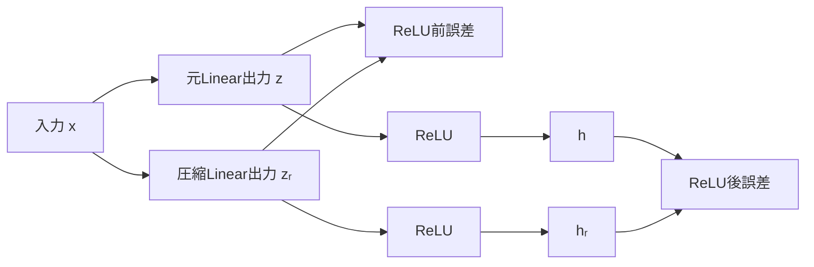
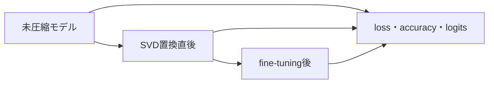

# 誤差評価

## サマリー

SVDでLinear層を低ランク化した後は、単に「元と違うか」を見るだけでは不十分である。

少なくとも、次の4段階を分けて評価する。

1. **重み行列の誤差**
2. **対象Linear層の出力誤差**
3. **活性化関数を通した後の誤差**
4. **モデル全体のタスク性能**


SVDの切り詰めによって最適になるのは、主に重み行列のノルム誤差である。

$$
\lVert W-W_r\rVert_F
$$

しかし、ニューラルネットワークで最終的に重要なのは、

- 実データを入力したときの出力差
- 損失関数の変化
- 分類精度の低下
- fine-tuning後にどこまで回復するか

である。

そのため、重み誤差が小さいことと、分類精度低下が小さいことを同一視しない。

この章では、次を整理する。

- 差分と誤差の定義
- MAE、MSE、RMSE
- フロベニウスノルム
- 相対誤差
- スペクトルノルム
- SVDの理論誤差
- Linear層の出力誤差
- ReLU後の誤差
- logits、loss、accuracyの評価
- データセット全体で正しく平均する方法
- PyTorchによる評価コード
- 実験結果の読み方

---

## 1. まず差分を定義する

元の値を、

$$
y_{\mathrm{original}}
$$

近似後の値を、

$$
y_{\mathrm{approx}}
$$

とする。

差分を、

$$
d
=
y_{\mathrm{original}}
-
y_{\mathrm{approx}}
$$

と定義する。

PyTorchでは、

```python
difference = (
    y_original
    -
    y_approx
)
```

と書く。

### 差分には符号がある

たとえば、

$$
y_{\mathrm{original}}=5
$$

$$
y_{\mathrm{approx}}=3
$$

なら、

$$
d=2
$$

である。

一方、

$$
y_{\mathrm{original}}=3
$$

$$
y_{\mathrm{approx}}=5
$$

なら、

$$
d=-2
$$

である。

どちらも誤差の大きさは2だが、差分の符号は異なる。

---

## 2. 差分をそのまま平均してはいけない理由

差分の平均を、

$$
\frac{1}{N}
\sum_{i=1}^{N}
d_i
$$

とすると、正と負の差分が打ち消し合う。

たとえば、

$$
d_1=2
$$

$$
d_2=-2
$$

なら、

$$
\frac{2+(-2)}{2}=0
$$

となる。

しかし、2つの値はどちらも元から2ずれている。

したがって、誤差の大きさを測るときは、

- 絶対値を取る
- 二乗する

などによって符号を取り除く。

---

## 3. MAE

MAEはMean Absolute Error、平均絶対誤差である。

$$
\operatorname{MAE}
=
\frac{1}{N}
\sum_{i=1}^{N}
\left|
y_i-\hat{y}_i
\right|
$$

差分 $d_i$ を使えば、

$$
\operatorname{MAE}
=
\frac{1}{N}
\sum_{i=1}^{N}
|d_i|
$$

である。

PyTorchでは、

```python
mae = torch.mean(
    difference.abs()
)
```

と書く。

### MAEの特徴

- 元の単位と同じ
- 誤差の大きさを直感的に読みやすい
- 大きな誤差をMSEほど強く重視しない
- すべての絶対誤差を線形に平均する

---

## 4. MSE

MSEはMean Squared Error、平均二乗誤差である。

$$
\operatorname{MSE}
=
\frac{1}{N}
\sum_{i=1}^{N}
\left(
y_i-\hat{y}_i
\right)^2
$$

差分 $d_i$ を使えば、

$$
\operatorname{MSE}
=
\frac{1}{N}
\sum_{i=1}^{N}
d_i^2
$$

である。

PyTorchでは、

```python
mse = torch.mean(
    difference ** 2
)
```

または、

```python
mse = torch.mean(
    difference.square()
)
```

と書く。

### 「絶対値ではないのか」

MSEでは絶対値ではなく二乗を使う。

ただし、二乗すると、

$$
d_i^2\geq0
$$

となるため、正負の差分は打ち消し合わない。

たとえば、

$$
(-2)^2=4
$$

$$
2^2=4
$$

であり、符号によらず同じ誤差として扱われる。

### MSEの特徴

- 大きな誤差を強く重視する
- 微分しやすく、学習の損失関数にも使いやすい
- 単位が元の値の二乗になる
- 値のスケールを直感的に読みづらいことがある

---

## 5. MAEとMSEの違い

差分が、

$$
d=
\begin{bmatrix}
1 & 1 & 1 & 5
\end{bmatrix}
$$

だとする。

MAEは、

$$
\operatorname{MAE}
=
\frac{
1+1+1+5
}{4}
=
2
$$

である。

MSEは、

$$
\operatorname{MSE}
=
\frac{
1^2+1^2+1^2+5^2
}{4}
$$

$$
\operatorname{MSE}
=
\frac{28}{4}
=
7
$$

である。

大きな誤差5が、二乗によって25となるため、MSEへ強く影響する。

| 指標 | 計算 | 大きな誤差への反応 |
|---|---|---|
| MAE | 絶対値を平均 | 線形 |
| MSE | 二乗を平均 | 強く反応 |
| RMSE | MSEの平方根 | MSEと同じ順位、元の単位 |

---

## 6. RMSE

RMSEはRoot Mean Squared Error、二乗平均平方根誤差である。

$$
\operatorname{RMSE}
=
\sqrt{
\operatorname{MSE}
}
$$

展開すると、

$$
\operatorname{RMSE}
=
\sqrt{
\frac{1}{N}
\sum_{i=1}^{N}
\left(
y_i-\hat{y}_i
\right)^2
}
$$

PyTorchでは、

```python
rmse = torch.sqrt(mse)
```

または、

```python
rmse = torch.sqrt(
    torch.mean(
        difference.square()
    )
)
```

と書く。

### RMSEの特徴

- 元の値と同じ単位
- 大きな誤差をMAEより強く重視
- MSEより値を直感的に読みやすい
- MSEが小さいモデルとRMSEが小さいモデルの順位は同じ

平方根は単調増加関数なので、

$$
\operatorname{MSE}_1
<
\operatorname{MSE}_2
$$

なら、

$$
\operatorname{RMSE}_1
<
\operatorname{RMSE}_2
$$

である。

---

## 7. 最大絶対誤差

すべての要素の中で、最も大きい絶対誤差を測る。

$$
E_{\max}
=
\max_i
|d_i|
$$

PyTorchでは、

```python
maximum_absolute_error = (
    difference
    .abs()
    .max()
)
```

である。

### 何が分かるか

MSEやRMSEが小さくても、一部の要素だけ非常に大きくずれている場合がある。

最大絶対誤差を併記すると、局所的な大誤差を見落としにくい。

### 注意

1つの外れ値に強く影響されるため、最大絶対誤差だけで全体を評価しない。

---

## 8. 平均誤差

符号付き差分の平均を、

$$
\operatorname{ME}
=
\frac{1}{N}
\sum_{i=1}^{N}
d_i
$$

とする。

これは誤差の大きさより、近似に系統的な偏りがあるかを見る指標である。

- 正：近似値が平均的に小さい
- 負：近似値が平均的に大きい
- 0付近：正負の偏りが少ない

PyTorchでは、

```python
mean_error = difference.mean()
```

である。

平均誤差が0でも、MAEやRMSEが0とは限らない。

---

## 9. ベクトル・行列に対するMSE

出力テンソルを、

$$
Y
\in
\mathbb{R}^{N\times D}
$$

近似出力を、

$$
\hat{Y}
\in
\mathbb{R}^{N\times D}
$$

とする。

差分行列は、

$$
E=Y-\hat{Y}
$$

である。

全要素に対するMSEは、

$$
\operatorname{MSE}
=
\frac{1}{ND}
\sum_{n=1}^{N}
\sum_{j=1}^{D}
E_{nj}^2
$$

である。

PyTorchの、

```python
torch.mean(
    (Y - Y_hat).square()
)
```

は、全要素をまとめて平均する。

---

## 10. フロベニウスノルム

行列 $E$ のフロベニウスノルムは、

$$
\lVert E\rVert_F
=
\sqrt{
\sum_{i}
\sum_{j}
E_{ij}^2
}
$$

である。

PyTorchでは、

```python
frobenius_error = (
    torch.linalg.matrix_norm(
        error_matrix,
        ord="fro",
    )
)
```

または、任意次元のテンソルなら、

```python
frobenius_like_error = (
    error_tensor
    .square()
    .sum()
    .sqrt()
)
```

と計算できる。

### MSEとの関係

$E$ の要素数を、

$$
M=ND
$$

とする。

すると、

$$
\operatorname{MSE}
=
\frac{
\lVert E\rVert_F^2
}{
M
}
$$

である。

RMSEは、

$$
\operatorname{RMSE}
=
\frac{
\lVert E\rVert_F
}{
\sqrt{M}
}
$$

となる。

したがって、同じ差分テンソルに対して、MSE、RMSE、フロベニウスノルムは密接に関係する。

---

## 11. フロベニウスノルムとRMSEの使い分け

### フロベニウスノルム

- 行列全体の総誤差
- 要素数が多いほど大きくなりやすい
- SVDの理論式と直接対応する
- 同じ形状の重み行列比較に適する

### RMSE

- 1要素当たりの代表的な誤差
- 要素数で正規化される
- 異なるバッチサイズでも比較しやすい
- 出力誤差の直感的な比較に適する

重み行列のSVD理論ではフロベニウスノルムを使い、層出力の比較ではRMSEも併記すると分かりやすい。

---

## 12. 相対誤差

絶対誤差は、対象の値の大きさに依存する。

たとえば、フロベニウス誤差が1であっても、

- 元の重みノルムが100
- 元の重みノルムが2

では意味が異なる。

相対フロベニウス誤差を、

$$
\varepsilon_{\mathrm{relative}}
=
\frac{
\lVert W-W_r\rVert_F
}{
\lVert W\rVert_F
}
$$

と定義する。

PyTorchでは、

```python
relative_error = (
    torch.linalg.matrix_norm(
        W - W_rank,
        ord="fro",
    )
    /
    torch.linalg.matrix_norm(
        W,
        ord="fro",
    )
)
```

と書く。

### 解釈

$$
\varepsilon_{\mathrm{relative}}=0
$$

なら完全一致である。

$$
\varepsilon_{\mathrm{relative}}=0.1
$$

なら、フロベニウスノルム基準で元の10%程度の誤差である。

---

## 13. 相対誤差の分母が0の場合

元のテンソルがすべて0なら、

$$
\lVert W\rVert_F=0
$$

となり、相対誤差を定義できない。

実装では、

- 分母が0なら絶対誤差だけを報告する
- 両方0なら相対誤差を0とする
- 小さい定数を加える

などの方針を明記する。

単純に小さい定数を加えると指標の意味が変わるため、実験ノートでは条件分岐の方が分かりやすい。

---

## 14. 相対RMSE

出力テンソルについて、基準出力のRMSで正規化する方法がある。

$$
\operatorname{RMS}(Y)
=
\sqrt{
\frac{1}{M}
\sum_i
Y_i^2
}
$$

相対RMSEを、

$$
\operatorname{RelativeRMSE}
=
\frac{
\operatorname{RMSE}(Y,\hat{Y})
}{
\operatorname{RMS}(Y)
}
$$

と定義できる。

これは、出力の典型的な大きさに対して誤差がどの程度かを表す。

ただし、基準出力がほぼ0の場合は不安定になる。

---

## 15. コサイン類似度

ベクトルの向きがどれだけ一致するかを見る指標として、コサイン類似度がある。

$$
\operatorname{cos}
\left(
y,\hat{y}
\right)
=
\frac{
y^{\mathsf{T}}\hat{y}
}{
\lVert y\rVert_2
\lVert\hat{y}\rVert_2
}
$$

値は通常、

$$
-1
\leq
\operatorname{cos}
\left(
y,\hat{y}
\right)
\leq1
$$

である。

PyTorchでは、

```python
cosine_similarity = (
    torch.nn.functional.cosine_similarity(
        y_original,
        y_approx,
        dim=-1,
    )
)
```

と計算できる。

### 注意

コサイン類似度が高くても、出力の大きさが異なる場合がある。

たとえば、

$$
\hat{y}=10y
$$

なら向きは同じなのでコサイン類似度は1だが、値の誤差は大きい。

MAEやRMSEと併用する。

---

## 16. 重み行列の誤差

元の重みを、

$$
W
\in
\mathbb{R}^{m\times n}
$$

rank $r$ 近似を、

$$
W_r
$$

とする。

重み差分は、

$$
E_W
=
W-W_r
$$

である。

評価候補は次のとおりである。

- フロベニウス誤差
- 相対フロベニウス誤差
- 重み要素MSE
- 重み要素RMSE
- 最大絶対誤差
- スペクトルノルム誤差

---

## 17. SVDのフロベニウス誤差

特異値を、

$$
\sigma_1
\geq
\sigma_2
\geq
\cdots
\geq
\sigma_k
$$

とする。

切り詰めSVDでは、

$$
\lVert
W-W_r
\rVert_F^2
=
\sum_{i=r+1}^{k}
\sigma_i^2
$$

である。

したがって、

$$
\lVert
W-W_r
\rVert_F
=
\sqrt{
\sum_{i=r+1}^{k}
\sigma_i^2
}
$$

となる。

この式により、$W_r$ を明示的に再構成しなくても理論誤差を計算できる。

---

## 18. 特異値エネルギーとの関係

エネルギー保持率を、

$$
E(r)
=
\frac{
\sum_{i=1}^{r}
\sigma_i^2
}{
\sum_{i=1}^{k}
\sigma_i^2
}
$$

とする。

相対フロベニウス誤差の二乗は、

$$
\frac{
\lVert W-W_r\rVert_F^2
}{
\lVert W\rVert_F^2
}
=
1-E(r)
$$

である。

したがって、

$$
\frac{
\lVert W-W_r\rVert_F
}{
\lVert W\rVert_F
}
=
\sqrt{
1-E(r)
}
$$

となる。

### 例

$$
E(r)=0.99
$$

なら、

$$
\varepsilon_{\mathrm{relative}}
=
\sqrt{0.01}
=
0.1
$$

である。

エネルギー99%保持は、相対フロベニウス誤差10%に対応する。

---

## 19. スペクトルノルム誤差

行列 $A$ のスペクトルノルムは、

$$
\lVert A\rVert_2
=
\max_{
\lVert x\rVert_2=1
}
\lVert Ax\rVert_2
$$

である。

切り詰めSVDでは、

$$
\lVert
W-W_r
\rVert_2
=
\sigma_{r+1}
$$

となる。

rank $r$ で捨てた中の最大特異値が、最悪方向の誤差を決める。

PyTorchでは、

```python
spectral_error = (
    torch.linalg.matrix_norm(
        W - W_rank,
        ord=2,
    )
)
```

で計算できる。

ただし、大きな行列ではフロベニウスノルムより計算コストが高い場合がある。

---

## 20. 理論誤差と実測誤差を一致させる

```python
import torch

torch.manual_seed(0)

W = torch.randn(
    8,
    5,
    dtype=torch.float64,
)

rank = 2

U, S, Vh = torch.linalg.svd(
    W,
    full_matrices=False,
)

W_rank = (
    U[:, :rank]
    * S[:rank].unsqueeze(0)
) @ Vh[:rank, :]

measured_frobenius = (
    torch.linalg.matrix_norm(
        W - W_rank,
        ord="fro",
    )
)

theoretical_frobenius = torch.sqrt(
    torch.sum(
        S[rank:].square()
    )
)

measured_spectral = (
    torch.linalg.matrix_norm(
        W - W_rank,
        ord=2,
    )
)

theoretical_spectral = S[rank]

print(
    measured_frobenius.item(),
    theoretical_frobenius.item(),
)

print(
    measured_spectral.item(),
    theoretical_spectral.item(),
)
```

数値誤差の範囲で一致する。

---

## 21. Linear層の出力誤差

元のLinear層を、

$$
y=Wx+b
$$

低ランク化後を、

$$
y_r=W_rx+b
$$

とする。

biasを同じに保っている場合、出力差は、

$$
e_y
=
y-y_r
$$

$$
e_y
=
(W-W_r)x
$$

となる。

biasは差分から消える。

つまり、出力誤差は、

- 重み差分 $W-W_r$
- 入力 $x$

の両方に依存する。

---

## 22. 出力誤差をSVD基底で見る

入力を右特異ベクトル方向へ展開する。

$$
x
=
\sum_{i=1}^{k}
\alpha_i v_i
+
x_{\perp}
$$

ここで、

$$
\alpha_i
=
v_i^{\mathsf{T}}x
$$

である。

元の出力は、

$$
Wx
=
\sum_{i=1}^{k}
\sigma_i
\alpha_i
u_i
$$

rank $r$ 近似の出力は、

$$
W_rx
=
\sum_{i=1}^{r}
\sigma_i
\alpha_i
u_i
$$

したがって、出力誤差は、

$$
(W-W_r)x
=
\sum_{i=r+1}^{k}
\sigma_i
\alpha_i
u_i
$$

である。

小さい特異値を捨てても、入力がその方向へ強く成分を持つ場合、出力誤差は無視できない。

---

## 23. 出力誤差の上限

任意の入力 $x$ に対して、

$$
\lVert
(W-W_r)x
\rVert_2
\leq
\lVert
W-W_r
\rVert_2
\lVert x\rVert_2
$$

が成り立つ。

切り詰めSVDでは、

$$
\lVert
W-W_r
\rVert_2
=
\sigma_{r+1}
$$

なので、

$$
\lVert
(W-W_r)x
\rVert_2
\leq
\sigma_{r+1}
\lVert x\rVert_2
$$

となる。

入力ノルムが大きいほど、同じ重み誤差でも出力誤差の上限は大きくなる。

---

## 24. バッチ出力の誤差

バッチ入力を、

$$
X
\in
\mathbb{R}^{
N\times D_{\mathrm{in}}
}
$$

とする。

元の出力は、

$$
Y
=
XW^{\mathsf{T}}
+b
$$

圧縮後は、

$$
Y_r
=
XW_r^{\mathsf{T}}
+b
$$

である。

差分は、

$$
E_Y
=
Y-Y_r
$$

$$
E_Y
=
X
\left(
W-W_r
\right)^{\mathsf{T}}
$$

となる。

### フロベニウスノルム上限

$$
\lVert
E_Y
\rVert_F
\leq
\lVert X\rVert_F
\lVert
W-W_r
\rVert_2
$$

したがって、

$$
\lVert
E_Y
\rVert_F
\leq
\lVert X\rVert_F
\sigma_{r+1}
$$

である。

---

## 25. biasが同じでない場合

元のbiasを $b$、圧縮後を $b_r$ とする。

$$
Y
=
XW^{\mathsf{T}}
+b
$$

$$
Y_r
=
XW_r^{\mathsf{T}}
+b_r
$$

差分は、

$$
E_Y
=
X
\left(
W-W_r
\right)^{\mathsf{T}}
+
\left(
b-b_r
\right)
$$

となる。

バッチではbias差が全サンプルへ加わる。

SVD置換直後の比較では、元biasを後段へ正しくコピーし、重み近似だけの影響を測る。

---

## 26. 1層の出力誤差を測る

```python
from __future__ import annotations

import torch
from torch import nn


def layer_output_rmse(
    original: nn.Module,
    compressed: nn.Module,
    x: torch.Tensor,
) -> torch.Tensor:
    original.eval()
    compressed.eval()

    with torch.no_grad():
        y_original = original(x)
        y_compressed = compressed(x)

    return torch.sqrt(
        torch.mean(
            (
                y_original
                -
                y_compressed
            ).square()
        )
    )
```

対象層だけを直接比較すると、後続層の影響を含めず、低ランク置換そのものの誤差を確認できる。

---

## 27. 重み誤差と出力誤差が比例しない理由

重みフロベニウス誤差が同じでも、入力分布が異なると出力誤差は変わる。

### 入力が捨てた方向を使わない場合

$$
v_i^{\mathsf{T}}x
\approx0
\quad
(i>r)
$$

なら、捨てた成分による出力誤差は小さい。

### 入力が捨てた方向を強く使う場合

$$
\left|
v_i^{\mathsf{T}}x
\right|
$$

が大きいと、特異値が小さくても誤差へ影響する。

したがって、ランダム入力だけでなく、実際のMNISTデータで層出力誤差を測る。

---

## 28. 入力分布を考慮した期待二乗誤差

入力の二次モーメントを、

$$
C_x
=
\mathbb{E}
\left[
xx^{\mathsf{T}}
\right]
$$

とする。

重み差を、

$$
\Delta W
=
W-W_r
$$

とする。

期待二乗出力誤差は、

$$
\mathbb{E}
\left[
\lVert
\Delta W x
\rVert_2^2
\right]
$$

である。

これは、

$$
\operatorname{tr}
\left(
\Delta W
C_x
\Delta W^{\mathsf{T}}
\right)
$$

と書ける。

通常のSVDは $C_x$ を使わず、重み行列だけを近似する。

そのため、通常のSVDは重み行列の近似として最適でも、実データ分布に対する出力誤差を直接最小化するとは限らない。

---

## 29. ReLU前とReLU後を分ける

元モデルの対象部分を、

$$
z=Wx+b
$$

$$
h=
\operatorname{ReLU}(z)
$$

とする。

圧縮後は、

$$
z_r=W_rx+b
$$

$$
h_r=
\operatorname{ReLU}(z_r)
$$

である。

評価では、

- ReLU前の誤差 $z-z_r$
- ReLU後の誤差 $h-h_r$

を分けて測る。

### Mermaid図



---

## 30. ReLUは距離を増やさない

スカラーに対して、

$$
\left|
\operatorname{ReLU}(a)
-
\operatorname{ReLU}(b)
\right|
\leq
|a-b|
$$

が成り立つ。

ベクトルに対しても、

$$
\left\lVert
\operatorname{ReLU}(z)
-
\operatorname{ReLU}(z_r)
\right\rVert_2
\leq
\lVert
z-z_r
\rVert_2
$$

である。

したがって、ReLU単体は同じ2つの入力間の距離を拡大しない。

ただし、ReLUによって活性・非活性の状態が変わると、後続層へ渡る情報の構造が変化する。

---

## 31. 活性状態の一致率

ReLU前の符号が一致しているかを測る。

元の活性マスクを、

$$
M
=
\mathbf{1}
\left[
z>0
\right]
$$

圧縮後を、

$$
M_r
=
\mathbf{1}
\left[
z_r>0
\right]
$$

とする。

一致率は、

$$
R_{\mathrm{mask}}
=
\frac{
\#\left(
M=M_r
\right)
}{
\text{全要素数}
}
$$

である。

PyTorchでは、

```python
mask_match_ratio = (
    (z_original > 0)
    ==
    (z_compressed > 0)
).float().mean()
```

と計算できる。

これは、圧縮によってReLUのON/OFFがどれだけ変わったかを示す補助指標である。

---

## 32. 後続層による誤差の増幅

圧縮対象層の後ろにLinear層 $C$ があるとする。

対象層の出力差を、

$$
\delta h
$$

とすると、次のLinear層での差は、

$$
C\delta h
$$

となる。

その大きさは、

$$
\lVert
C\delta h
\rVert_2
\leq
\lVert C\rVert_2
\lVert\delta h\rVert_2
$$

である。

後続層のスペクトルノルムが大きい場合、対象層の小さな誤差が増幅される可能性がある。

モデル全体の誤差は、対象層だけの重み誤差では決まらない。

---

## 33. logitsの誤差

分類モデルの最終出力をlogitsとする。

元のlogitsを、

$$
z
\in
\mathbb{R}^{C}
$$

圧縮後を、

$$
z_r
\in
\mathbb{R}^{C}
$$

とする。

評価候補：

- logitsのMAE
- logitsのRMSE
- logitsの最大絶対誤差
- コサイン類似度
- 予測クラス一致率
- 正解クラスmarginの変化

logitsはSoftmax前の値であり、CrossEntropyLossへそのまま入力する。

---

## 34. accuracyは連続的な誤差指標ではない

予測クラスは、

$$
\hat{c}
=
\operatorname{argmax}_j
z_j
$$

で決まる。

logitsが少し変化しても、最大値のクラスが同じならaccuracyは変化しない。

逆に、上位2クラスがほぼ同じ場合、小さな変化で予測が反転する。

したがって、

- accuracyが同じ
- logitsが同じ

ではない。

accuracyだけでは圧縮による内部変化を十分に捉えられない。

---

## 35. 予測margin

元の予測クラスを、

$$
c
=
\operatorname{argmax}_j
z_j
$$

とする。

上位クラスと2位クラスの差をmarginとする。

$$
m
=
z_c
-
\max_{j\neq c}
z_j
$$

marginが大きいサンプルは、logitsが多少変化しても予測が変わりにくい。

marginが小さいサンプルは、圧縮誤差によって予測が変わりやすい。

---

## 36. logits誤差と予測不変条件

logitsの変化を、

$$
\delta z
=
z_r-z
$$

とする。

各logitの変化が、

$$
\lVert
\delta z
\rVert_{\infty}
<
\frac{m}{2}
$$

を満たせば、元の1位クラスと他クラスの順位は保たれる。

これは十分条件であり、必要条件ではない。

accuracyが変化するかは、誤差の大きさだけでなく、元のmarginにも依存する。

---

## 37. 予測一致率

正解ラベルを使わず、未圧縮モデルと圧縮モデルの予測が一致する割合を測る。

$$
R_{\mathrm{agreement}}
=
\frac{
1
}{
N
}
\sum_{i=1}^{N}
\mathbf{1}
\left[
\hat{c}_i
=
\hat{c}_{r,i}
\right]
$$

PyTorchでは、

```python
agreement = (
    logits_original.argmax(dim=1)
    ==
    logits_compressed.argmax(dim=1)
).float().mean()
```

と計算できる。

### accuracyとの違い

- accuracy：正解ラベルとの一致
- 予測一致率：2つのモデル同士の一致

未圧縮モデルが誤答しているサンプルでも、両モデルが同じ誤答なら予測一致となる。

---

## 38. Cross Entropy Loss

多クラス分類で、1サンプルのlogitsを $z$、正解クラスを $c$ とする。

Cross Entropy Lossは、

$$
\mathcal{L}
=
-
\log
\left(
\frac{
\exp(z_c)
}{
\sum_j
\exp(z_j)
}
\right)
$$

である。

PyTorchでは、

```python
criterion = torch.nn.CrossEntropyLoss()
loss = criterion(
    logits,
    labels,
)
```

と計算する。

モデルの最後にSoftmaxを追加せず、logitsをそのまま渡す。

---

## 39. lossもaccuracyと併記する

圧縮によって予測クラスが変わらなくても、正解クラスの確信度が低下するとlossは増える。

たとえば、正解クラスが1位のままでも、

```text
圧縮前：正解クラス 0.99
圧縮後：正解クラス 0.55
```

ならaccuracyは同じだが、lossは悪化する。

したがって、

- accuracy
- loss

を両方記録する。

---

## 40. クラスごとの精度

全体accuracyがほぼ同じでも、特定クラスだけ精度が低下する場合がある。

クラス $c$ のaccuracyを、

$$
\operatorname{Accuracy}_c
=
\frac{
\text{クラス }c\text{ の正解数}
}{
\text{クラス }c\text{ のサンプル数}
}
$$

とする。

MNISTでは0から9までの10クラスについて確認できる。

強い圧縮で、特定の数字の区別が悪化していないかを調べる補助評価になる。

---

## 41. 混同行列

混同行列は、正解クラスと予測クラスの組み合わせを数える。

$$
C_{ij}
=
\#\left\{
\text{正解 }i
\text{、予測 }j
\right\}
$$

圧縮前後の混同行列を比較すると、

- 4を9と誤る
- 3を5と誤る

など、どの誤分類が増えたかを確認できる。

最初のrank比較ではaccuracyを優先し、特徴的なrankについて混同行列を追加するとよい。

---

## 42. 誤差評価の階層

```text
レベル1：重み
W と W_r

レベル2：対象Linear出力
Wx+b と W_r x+b

レベル3：活性化後
ReLU(Wx+b) と ReLU(W_r x+b)

レベル4：モデルlogits
z と z_r

レベル5：タスク
loss・accuracy・クラス別精度
```

上のレベルほど、実際のタスクへ近い。

下のレベルほど、SVDによる変化の原因を直接分析しやすい。

---

## 43. どの指標を最低限使うか

最初のMNIST実験では、各rankについて次を最低限記録する。

### 重み

- 相対フロベニウス誤差
- 特異値エネルギー保持率

### 層出力

- RMSE
- 相対RMSE
- 最大絶対誤差

### モデル

- test loss
- test accuracy
- 未圧縮モデルとの予測一致率

### 圧縮

- パラメータ保持率
- 圧縮倍率

この組み合わせなら、圧縮量・行列誤差・出力誤差・タスク性能を一通り確認できる。

---

## 44. 誤差指標をまとめるデータクラス

```python
from __future__ import annotations

from dataclasses import dataclass

import torch
import torch.nn.functional as F


@dataclass(frozen=True)
class TensorErrorMetrics:
    element_count: int
    mean_error: float
    mae: float
    mse: float
    rmse: float
    maximum_absolute_error: float
    reference_rms: float
    relative_rmse: float | None
    cosine_similarity_mean: float | None
```

---

## 45. 2つのテンソルを比較する関数

```python
from __future__ import annotations

import torch
import torch.nn.functional as F


def compare_tensors(
    reference: torch.Tensor,
    approximation: torch.Tensor,
) -> TensorErrorMetrics:
    if reference.shape != approximation.shape:
        raise ValueError(
            "reference and approximation "
            "must have the same shape."
        )

    if reference.numel() == 0:
        raise ValueError(
            "input tensors must not be empty."
        )

    difference = (
        reference
        -
        approximation
    )

    mean_error_tensor = (
        difference.mean()
    )

    mae_tensor = (
        difference
        .abs()
        .mean()
    )

    mse_tensor = (
        difference
        .square()
        .mean()
    )

    rmse_tensor = torch.sqrt(
        mse_tensor
    )

    maximum_absolute_error_tensor = (
        difference
        .abs()
        .max()
    )

    reference_rms_tensor = torch.sqrt(
        reference
        .square()
        .mean()
    )

    if reference_rms_tensor.item() == 0.0:
        relative_rmse = None
    else:
        relative_rmse = float(
            (
                rmse_tensor
                /
                reference_rms_tensor
            ).item()
        )

    cosine_similarity_mean: float | None

    if reference.ndim == 0:
        cosine_similarity_mean = None

    elif reference.shape[-1] == 0:
        cosine_similarity_mean = None

    else:
        reference_flat = reference.reshape(
            -1,
            reference.shape[-1],
        )

        approximation_flat = approximation.reshape(
            -1,
            approximation.shape[-1],
        )

        reference_norm = torch.linalg.vector_norm(
            reference_flat,
            dim=-1,
        )

        approximation_norm = (
            torch.linalg.vector_norm(
                approximation_flat,
                dim=-1,
            )
        )

        valid = (
            (reference_norm > 0)
            &
            (approximation_norm > 0)
        )

        if bool(valid.any()):
            cosine_values = (
                F.cosine_similarity(
                    reference_flat[valid],
                    approximation_flat[valid],
                    dim=-1,
                )
            )

            cosine_similarity_mean = float(
                cosine_values.mean().item()
            )
        else:
            cosine_similarity_mean = None

    return TensorErrorMetrics(
        element_count=reference.numel(),
        mean_error=float(
            mean_error_tensor.item()
        ),
        mae=float(
            mae_tensor.item()
        ),
        mse=float(
            mse_tensor.item()
        ),
        rmse=float(
            rmse_tensor.item()
        ),
        maximum_absolute_error=float(
            maximum_absolute_error_tensor.item()
        ),
        reference_rms=float(
            reference_rms_tensor.item()
        ),
        relative_rmse=relative_rmse,
        cosine_similarity_mean=(
            cosine_similarity_mean
        ),
    )
```

---

## 46. 重み評価用のデータクラス

```python
from __future__ import annotations

from dataclasses import dataclass

import torch


@dataclass(frozen=True)
class WeightErrorMetrics:
    frobenius_error: float
    relative_frobenius_error: float | None
    spectral_error: float
    weight_mse: float
    weight_rmse: float
    maximum_absolute_error: float
```

---

## 47. 重み行列を比較する関数

```python
from __future__ import annotations

import torch


def compare_weight_matrices(
    original: torch.Tensor,
    approximation: torch.Tensor,
) -> WeightErrorMetrics:
    if original.ndim != 2:
        raise ValueError(
            "original must be a matrix."
        )

    if original.shape != approximation.shape:
        raise ValueError(
            "matrix shapes must match."
        )

    difference = (
        original
        -
        approximation
    )

    frobenius_error_tensor = (
        torch.linalg.matrix_norm(
            difference,
            ord="fro",
        )
    )

    original_frobenius_tensor = (
        torch.linalg.matrix_norm(
            original,
            ord="fro",
        )
    )

    if original_frobenius_tensor.item() == 0.0:
        relative_frobenius_error = None
    else:
        relative_frobenius_error = float(
            (
                frobenius_error_tensor
                /
                original_frobenius_tensor
            ).item()
        )

    spectral_error_tensor = (
        torch.linalg.matrix_norm(
            difference,
            ord=2,
        )
    )

    mse_tensor = (
        difference
        .square()
        .mean()
    )

    return WeightErrorMetrics(
        frobenius_error=float(
            frobenius_error_tensor.item()
        ),
        relative_frobenius_error=(
            relative_frobenius_error
        ),
        spectral_error=float(
            spectral_error_tensor.item()
        ),
        weight_mse=float(
            mse_tensor.item()
        ),
        weight_rmse=float(
            torch.sqrt(
                mse_tensor
            ).item()
        ),
        maximum_absolute_error=float(
            difference
            .abs()
            .max()
            .item()
        ),
    )
```

---

## 48. 低ランク2層から重みを再構成する

圧縮後の前段重みを $A$、後段重みを $B$ とする。

再構成重みは、

$$
W_r=BA
$$

である。

PyTorchでは、

```python
with torch.no_grad():
    reconstructed_weight = (
        compressed.second.weight
        @
        compressed.first.weight
    )
```

と計算する。

その後、

```python
weight_metrics = compare_weight_matrices(
    original=original.weight,
    approximation=reconstructed_weight,
)
```

で評価できる。

---

## 49. 層出力を比較する関数

```python
from __future__ import annotations

import torch
from torch import nn


def compare_layer_outputs(
    original_layer: nn.Module,
    compressed_layer: nn.Module,
    inputs: torch.Tensor,
) -> TensorErrorMetrics:
    original_layer.eval()
    compressed_layer.eval()

    with torch.inference_mode():
        original_output = (
            original_layer(inputs)
        )

        compressed_output = (
            compressed_layer(inputs)
        )

    return compare_tensors(
        reference=original_output,
        approximation=compressed_output,
    )
```

---

## 50. ReLU前後を同時に比較する

```python
from __future__ import annotations

from dataclasses import dataclass

import torch
from torch import nn


@dataclass(frozen=True)
class ActivationComparison:
    pre_activation: TensorErrorMetrics
    post_activation: TensorErrorMetrics
    relu_mask_match_ratio: float


def compare_with_relu(
    original_layer: nn.Module,
    compressed_layer: nn.Module,
    inputs: torch.Tensor,
) -> ActivationComparison:
    original_layer.eval()
    compressed_layer.eval()

    with torch.inference_mode():
        z_original = original_layer(
            inputs
        )

        z_compressed = compressed_layer(
            inputs
        )

        h_original = torch.relu(
            z_original
        )

        h_compressed = torch.relu(
            z_compressed
        )

        mask_match_ratio = (
            (
                (z_original > 0)
                ==
                (z_compressed > 0)
            )
            .float()
            .mean()
        )

    return ActivationComparison(
        pre_activation=compare_tensors(
            z_original,
            z_compressed,
        ),
        post_activation=compare_tensors(
            h_original,
            h_compressed,
        ),
        relu_mask_match_ratio=float(
            mask_match_ratio.item()
        ),
    )
```

---

## 51. データセット全体でのMSE

データセット全体のMSEは、

$$
\operatorname{MSE}
=
\frac{
\text{全二乗誤差の合計}
}{
\text{全出力要素数}
}
$$

である。

バッチごとのMSEを単純平均すると、最後のバッチサイズが小さい場合に重み付けが不正確になる。

### 誤った可能性がある計算

```python
mse_values = []

for batch in loader:
    mse_values.append(
        batch_mse
    )

dataset_mse = sum(
    mse_values
) / len(mse_values)
```

各バッチの要素数が同じなら問題は小さいが、一般には全二乗誤差と全要素数を積算する。

---

## 52. RMSEをバッチごとに平均してはいけない

RMSEは平方根を含むため、バッチRMSEの平均はデータセット全体のRMSEと一致しない。

一般に、

$$
\frac{1}{B}
\sum_{b=1}^{B}
\sqrt{
\operatorname{MSE}_b
}
\neq
\sqrt{
\frac{
\sum_b
\operatorname{SSE}_b
}{
\sum_b
N_b
}
}
$$

である。

正しくは、

1. 各バッチの二乗誤差和を足す
2. 全要素数で割ってMSEを求める
3. 最後に平方根を取る

という順序で計算する。

---

## 53. ストリーミング誤差集計器

```python
from __future__ import annotations

from dataclasses import dataclass

import torch


@dataclass
class ErrorAccumulator:
    element_count: int = 0
    signed_error_sum: float = 0.0
    absolute_error_sum: float = 0.0
    squared_error_sum: float = 0.0
    reference_squared_sum: float = 0.0
    maximum_absolute_error: float = 0.0

    def update(
        self,
        reference: torch.Tensor,
        approximation: torch.Tensor,
    ) -> None:
        if reference.shape != approximation.shape:
            raise ValueError(
                "tensor shapes must match."
            )

        difference = (
            reference
            -
            approximation
        )

        self.element_count += (
            difference.numel()
        )

        self.signed_error_sum += float(
            difference.sum().item()
        )

        self.absolute_error_sum += float(
            difference
            .abs()
            .sum()
            .item()
        )

        self.squared_error_sum += float(
            difference
            .square()
            .sum()
            .item()
        )

        self.reference_squared_sum += float(
            reference
            .square()
            .sum()
            .item()
        )

        batch_maximum = float(
            difference
            .abs()
            .max()
            .item()
        )

        self.maximum_absolute_error = max(
            self.maximum_absolute_error,
            batch_maximum,
        )

    def compute(
        self,
    ) -> TensorErrorMetrics:
        if self.element_count == 0:
            raise ValueError(
                "no elements were accumulated."
            )

        mean_error = (
            self.signed_error_sum
            /
            self.element_count
        )

        mae = (
            self.absolute_error_sum
            /
            self.element_count
        )

        mse = (
            self.squared_error_sum
            /
            self.element_count
        )

        rmse = mse ** 0.5

        reference_rms = (
            self.reference_squared_sum
            /
            self.element_count
        ) ** 0.5

        relative_rmse = (
            None
            if reference_rms == 0.0
            else rmse / reference_rms
        )

        return TensorErrorMetrics(
            element_count=self.element_count,
            mean_error=mean_error,
            mae=mae,
            mse=mse,
            rmse=rmse,
            maximum_absolute_error=(
                self.maximum_absolute_error
            ),
            reference_rms=reference_rms,
            relative_rmse=relative_rmse,
            cosine_similarity_mean=None,
        )
```

この集計器では、コサイン類似度は積算していない。

必要なら、サンプル単位の総和と件数を別途保持する。

---

## 54. DataLoader全体で層出力を比較する

DataLoaderが画像とラベルを返すとする。

対象層の入力を直接作れる場合の例を示す。

```python
from __future__ import annotations

import torch
from torch import nn
from torch.utils.data import DataLoader


def evaluate_mnist_first_layer_error(
    original_layer: nn.Module,
    compressed_layer: nn.Module,
    loader: DataLoader,
    device: torch.device,
) -> TensorErrorMetrics:
    original_layer.eval()
    compressed_layer.eval()

    accumulator = ErrorAccumulator()

    with torch.inference_mode():
        for images, _ in loader:
            images = images.to(
                device
            )

            inputs = images.flatten(
                start_dim=1
            )

            original_output = (
                original_layer(
                    inputs
                )
            )

            compressed_output = (
                compressed_layer(
                    inputs
                )
            )

            accumulator.update(
                reference=original_output,
                approximation=compressed_output,
            )

    return accumulator.compute()
```

MNISTの第1Linear層では、画像をFlattenしたテンソルが層入力になる。

---

## 55. モデル全体の評価結果

```python
from __future__ import annotations

from dataclasses import dataclass


@dataclass(frozen=True)
class ClassificationMetrics:
    sample_count: int
    average_loss: float
    accuracy: float
```

---

## 56. モデルのlossとaccuracyを計算する

```python
from __future__ import annotations

import torch
from torch import nn
from torch.utils.data import DataLoader


def evaluate_classifier(
    model: nn.Module,
    loader: DataLoader,
    criterion: nn.Module,
    device: torch.device,
) -> ClassificationMetrics:
    model.eval()

    total_loss = 0.0
    total_correct = 0
    total_samples = 0

    with torch.inference_mode():
        for inputs, labels in loader:
            inputs = inputs.to(
                device
            )

            labels = labels.to(
                device
            )

            logits = model(
                inputs
            )

            loss = criterion(
                logits,
                labels,
            )

            batch_size = (
                labels.shape[0]
            )

            total_loss += (
                float(
                    loss.item()
                )
                *
                batch_size
            )

            predictions = (
                logits.argmax(
                    dim=1
                )
            )

            total_correct += int(
                (
                    predictions
                    ==
                    labels
                )
                .sum()
                .item()
            )

            total_samples += (
                batch_size
            )

    if total_samples == 0:
        raise ValueError(
            "loader produced no samples."
        )

    return ClassificationMetrics(
        sample_count=total_samples,
        average_loss=(
            total_loss
            /
            total_samples
        ),
        accuracy=(
            total_correct
            /
            total_samples
        ),
    )
```

`CrossEntropyLoss` の既定 `reduction="mean"` を想定し、バッチlossへバッチサイズを掛けてから全サンプル数で割る。

---

## 57. 圧縮前後のlogitsを比較する

```python
from __future__ import annotations

import torch
from torch import nn
from torch.utils.data import DataLoader


@dataclass(frozen=True)
class ModelComparisonMetrics:
    logits_error: TensorErrorMetrics
    prediction_agreement: float


def compare_model_outputs(
    original_model: nn.Module,
    compressed_model: nn.Module,
    loader: DataLoader,
    device: torch.device,
) -> ModelComparisonMetrics:
    original_model.eval()
    compressed_model.eval()

    accumulator = ErrorAccumulator()

    agreement_count = 0
    sample_count = 0

    with torch.inference_mode():
        for inputs, _ in loader:
            inputs = inputs.to(
                device
            )

            original_logits = (
                original_model(
                    inputs
                )
            )

            compressed_logits = (
                compressed_model(
                    inputs
                )
            )

            accumulator.update(
                original_logits,
                compressed_logits,
            )

            original_prediction = (
                original_logits.argmax(
                    dim=1
                )
            )

            compressed_prediction = (
                compressed_logits.argmax(
                    dim=1
                )
            )

            agreement_count += int(
                (
                    original_prediction
                    ==
                    compressed_prediction
                )
                .sum()
                .item()
            )

            sample_count += (
                inputs.shape[0]
            )

    if sample_count == 0:
        raise ValueError(
            "loader produced no samples."
        )

    return ModelComparisonMetrics(
        logits_error=accumulator.compute(),
        prediction_agreement=(
            agreement_count
            /
            sample_count
        ),
    )
```

---

## 58. 未圧縮・圧縮直後・fine-tuning後を分ける

結果は少なくとも3段階で記録する。

```text
1. Original
   学習済み未圧縮モデル

2. SVD compressed
   低ランク置換直後

3. Fine-tuned
   圧縮構造のまま再学習したモデル
```

### Mermaid図



圧縮直後とfine-tuning後を混同すると、SVD近似自体の性能と再学習による回復を区別できない。

---

## 59. 誤差評価で使う入力

評価入力には、次の選択肢がある。

### ランダム入力

- 実装確認に便利
- 形状や数式の検証に使える
- 実データ分布を反映しない

### 学習データ

- モデルが最適化された分布
- fine-tuningとの関係を見やすい
- 過学習の影響を受ける

### 検証・テストデータ

- 未知データに対する影響を確認できる
- 最終評価に適する
- テストデータでrankを選ぶと評価が楽観的になる

rank選択には検証データを使い、最終報告にはテストデータを使うのが基本である。

MNISTの初歩実験で検証集合を分けない場合は、その制限を明記する。

---

## 60. `eval()` を使う

DropoutやBatchNormを含むモデルでは、学習モードと評価モードで出力が変わる。

圧縮前後の比較では、

```python
model.eval()
```

を使う。

LinearとReLUだけの単純MLPでも、評価コードの習慣として統一する。

---

## 61. `torch.inference_mode()` を使う

評価時は勾配が不要である。

```python
with torch.inference_mode():
    output = model(inputs)
```

とすると、

- 勾配計算を行わない
- メモリ使用量を減らせる
- 評価を高速化しやすい

`torch.no_grad()` でもよいが、純粋な推論では `torch.inference_mode()` が使える。

---

## 62. 同じ入力で比較する

圧縮前後の誤差を測るときは、同じ入力を使う。

異なるミニバッチを使うと、モデル差と入力差を分離できない。

モデルコピーを作り、同じDataLoaderの同じバッチへ両モデルを適用する。

---

## 63. ランダム性を抑える

再現性を高めるため、必要に応じて乱数seedを固定する。

```python
import random
import numpy as np
import torch

seed = 0

random.seed(seed)
np.random.seed(seed)
torch.manual_seed(seed)

if torch.cuda.is_available():
    torch.cuda.manual_seed_all(
        seed
    )
```

ただし、GPU演算には完全な決定性を保証できない処理もある。

評価値の差が非常に小さい場合は、複数回測定も検討する。

---

## 64. dtypeによる数値誤差

SVD再構成を厳密に確認するときは、`float64` を使うと数値誤差を小さくしやすい。

実際のモデルが `float32` なら、最終評価は元のdtypeで行う。

`float16` や `bfloat16` では丸め誤差が大きいため、

- `torch.allclose` の許容誤差
- MSEや最大誤差

をdtypeに応じて解釈する。

---

## 65. `torch.allclose` は誤差指標ではない

`torch.allclose` は、2つのテンソルが許容誤差内で一致するかを真偽値で返す。

$$
|a_i-b_i|
\leq
\operatorname{atol}
+
\operatorname{rtol}|b_i|
$$

のような条件を全要素で確認する。

```python
is_close = torch.allclose(
    original,
    approximation,
    rtol=1e-5,
    atol=1e-6,
)
```

### 用途

- 最大rankで再構成できるか
- 手動計算とLinear出力が一致するか
- 実装バグがないか

### 不向きな用途

- rankごとの誤差量を比較する
- 圧縮品質を連続値で評価する

rank比較ではMAE、RMSE、相対誤差などを使う。

---

## 66. 最大rankをテストに使う

最大rankでは、

$$
W_r\approx W
$$

となる。

したがって、

- 重み誤差が数値丸め程度
- 層出力誤差が数値丸め程度
- モデルaccuracyが同じ

になるはずである。

最大rankで大きな差が出る場合は、

- $V$ と $V^{\mathsf{T}}$ の取り違え
- 前段と後段の順序
- 特異値の掛け方
- biasのコピー
- dtypeやdevice

を確認する。

---

## 67. rankを下げたときの期待される傾向

一般には、rankを下げると、

- パラメータ数：減る
- エネルギー保持率：下がる
- 重みフロベニウス誤差：増える
- 重みスペクトル誤差：増える
- 層出力RMSE：増える傾向
- logits RMSE：増える傾向
- loss：増える傾向
- accuracy：下がる可能性

がある。

ただし、タスク指標は厳密な単調性を保証されない。

---

## 68. 誤差とaccuracyの関係を可視化する

rankごとの結果を、

```text
相対重み誤差 → accuracy
層出力RMSE   → accuracy
logits RMSE  → accuracy
```

として散布図にできる。

```python
import matplotlib.pyplot as plt

plt.figure()
plt.scatter(
    relative_weight_errors,
    accuracies,
)
plt.xlabel("Relative weight error")
plt.ylabel("Test accuracy")
plt.title("Weight Error and Accuracy")
plt.grid(True)
plt.show()
```

重み誤差とタスク性能がどの程度対応するかを観察する。

---

## 69. rankと複数誤差を可視化する

尺度が異なるため、同じ縦軸へ無理に重ねず、個別のグラフを作る方が読みやすい。

```python
plt.figure()
plt.plot(
    ranks,
    output_rmses,
    marker="o",
)
plt.xlabel("Rank")
plt.ylabel("Layer output RMSE")
plt.title("Rank and Layer Output Error")
plt.grid(True)
plt.show()
```

```python
plt.figure()
plt.plot(
    ranks,
    accuracies,
    marker="o",
)
plt.xlabel("Rank")
plt.ylabel("Test accuracy")
plt.title("Rank and Accuracy")
plt.grid(True)
plt.show()
```

---

## 70. サンプルごとの誤差を見る

全体平均だけでなく、各サンプルのRMSEを計算できる。

出力次元を $D$ とすると、サンプル $n$ のRMSEは、

$$
\operatorname{RMSE}_n
=
\sqrt{
\frac{1}{D}
\sum_{j=1}^{D}
\left(
Y_{nj}
-
\hat{Y}_{nj}
\right)^2
}
$$

PyTorchでは、

```python
per_sample_rmse = torch.sqrt(
    (
        original_output
        -
        compressed_output
    )
    .square()
    .mean(
        dim=1
    )
)
```

と計算できる。

誤差の大きいサンプルを画像として確認すると、圧縮が苦手なパターンを分析できる。

---

## 71. 出力ユニットごとの誤差

出力次元 $j$ ごとのMSEは、

$$
\operatorname{MSE}_j
=
\frac{1}{N}
\sum_{n=1}^{N}
E_{nj}^2
$$

である。

PyTorchでは、

```python
per_feature_mse = (
    difference
    .square()
    .mean(
        dim=0
    )
)
```

と計算する。

特定ユニットだけ誤差が大きいかを確認できる。

---

## 72. 分布を確認する

平均値だけでなく、次も確認できる。

- 中央値
- 90パーセンタイル
- 95パーセンタイル
- 99パーセンタイル
- ヒストグラム

```python
absolute_error = (
    difference
    .abs()
    .flatten()
)

quantiles = torch.quantile(
    absolute_error,
    torch.tensor(
        [0.5, 0.9, 0.95, 0.99],
        device=absolute_error.device,
    ),
)
```

大部分の誤差は小さいが、一部だけ大きい場合を検出しやすい。

---

## 73. 指標を増やしすぎない

多くの指標を計算できるが、最初からすべてを主結果にすると解釈が難しくなる。

MNISTの最初の実験では、主指標を絞る。

### 主指標

- パラメータ保持率
- 相対重み誤差
- 層出力RMSE
- test loss
- test accuracy

### 補助指標

- 最大絶対誤差
- logits RMSE
- 予測一致率
- ReLUマスク一致率
- クラス別accuracy
- 推論時間

異常なrankや興味深い結果について、補助指標を詳しく見る。

---

## 74. よくある誤解

### MSEでは絶対値を取る

MSEは絶対値ではなく二乗を使う。

絶対値を平均する指標はMAEである。

### `difference.mean()` が小さければ誤差も小さい

正負の差分が打ち消し合うため、誤差の大きさを表さない。

### MSEとRMSEは別の順位を与える

RMSEはMSEの平方根なので、同じデータに対するモデル順位は同じである。

### RMSEを各バッチで求めて平均すればよい

一般にはデータセット全体のRMSEと一致しない。

二乗誤差和と要素数を積算し、最後に平方根を取る。

### フロベニウス誤差が小さければaccuracyも必ず高い

保証されない。

入力分布、ReLU、後続層、分類marginが影響する。

### accuracyが同じなら圧縮前後のモデルは同じ

logitsやloss、内部表現が変化している可能性がある。

### エネルギー保持率99%なら誤差は1%

相対**二乗**フロベニウス誤差が1%であり、相対フロベニウス誤差は10%である。

### biasをコピーしなくても重み誤差だけ見ればよい

層出力やモデル全体を比較する場合、bias差が混ざる。

元biasを正しくコピーしてから比較する。

### ランダム入力で出力誤差が小さければ十分

実データ分布での誤差を保証しない。

MNISTデータでも評価する。

### 最大rankでも少し誤差があるから実装が間違い

浮動小数点の丸め誤差は生じる。

誤差の大きさとdtypeに応じて判断する。

---

## 75. 実験結果表

各rankについて、次の表を作る。

| rank | パラメータ保持率 | エネルギー保持率 | 相対重み誤差 | 層出力RMSE | logits RMSE | 予測一致率 | test loss | test accuracy |
|---:|---:|---:|---:|---:|---:|---:|---:|---:|
| Original | 100% | 100% | 0 | 0 | 0 | 100% |  |  |
| 8 |  |  |  |  |  |  |  |  |
| 16 |  |  |  |  |  |  |  |  |
| 32 |  |  |  |  |  |  |  |  |
| 64 |  |  |  |  |  |  |  |  |
| 128 |  |  |  |  |  |  |  |  |
| 256 |  |  |  |  |  |  |  |  |

fine-tuning後は、別の行または列へ追加する。

---

## 76. 結果の読み方

### 重み誤差は増えたがaccuracyがほぼ同じ

捨てた方向がMNIST分類にあまり使われていない可能性がある。

圧縮余地がある結果である。

### 重み誤差は小さいがaccuracyが低下した

小さい特異方向が分類境界や一部サンプルに重要だった可能性がある。

ReLUマスクやクラス別精度を確認する。

### 層出力RMSEは増えたがlogits RMSEは小さい

後続層が誤差を抑えている可能性がある。

### 層出力RMSEは小さいがaccuracyが変化した

分類marginが小さいサンプルで順位が反転した可能性がある。

### fine-tuningで回復した

低rank構造には十分な表現力が残っていたが、単純SVD初期値がタスクへ完全には適応していなかった可能性がある。

### fine-tuningでも回復しない

rankが小さすぎて、必要な表現能力を失った可能性がある。

---

## 77. 研究・面接で説明するなら

### 30秒程度の説明

> SVD圧縮の評価では、重み誤差、層出力誤差、モデル全体のlossとaccuracyを分けて測ります。MSEは差分の二乗平均、RMSEはその平方根で元の単位に戻した指標です。切り詰めSVDでは、捨てた特異値の二乗和が重みのフロベニウス誤差の二乗になります。ただし、SVDが最小化するのは重み行列の誤差であり、分類精度を直接最小化するわけではないため、実データでの出力誤差とタスク性能も評価します。

### 研究でどう使うか

MNIST実験では、rankごとに、

- 相対フロベニウス誤差
- 層出力RMSE
- logits RMSE
- test loss
- test accuracy
- fine-tuning後accuracy

を比較する。

重み誤差と精度低下がどの程度対応するかを調べることが、単純SVD圧縮の重要な考察になる。

### 論文ではどう扱われるか

圧縮研究では、モデルサイズとaccuracyだけでなく、

- 圧縮直後かfine-tuning後か
- どのデータでrankを選んだか
- lossや出力誤差
- 推論条件

を明記すると再現性が高くなる。

現在の段階では、重み誤差・出力誤差・accuracyを一貫したコードで測定できることを優先する。

---

## 78. このノートで押さえるポイント

- 差分には符号があるため、そのまま平均すると打ち消し合う。
- MAEは絶対値の平均である。
- MSEは二乗誤差の平均である。
- RMSEはMSEの平方根であり、元の値と同じ単位になる。
- MSEでは絶対値ではなく二乗を使う。
- 最大絶対誤差は局所的な大誤差を確認するために使う。
- フロベニウスノルムは行列全体の二乗誤差和の平方根である。
- 行列MSEはフロベニウスノルムの二乗を要素数で割ったものになる。
- 相対誤差は元のテンソルの大きさで正規化する。
- 切り詰めSVDのフロベニウス誤差は、捨てた特異値の二乗和から求められる。
- 切り詰めSVDのスペクトル誤差は $\sigma_{r+1}$ である。
- 重み誤差と層出力誤差は同じではない。
- 層出力誤差は入力データの方向と大きさに依存する。
- biasを同じに保てば、Linear出力差ではbiasが相殺される。
- ReLU前とReLU後の誤差を分けて測る。
- accuracyが同じでもlogitsやlossが同じとは限らない。
- logitsのmarginが小さいサンプルは小さな誤差で予測が変わりやすい。
- データセット全体のRMSEは、バッチRMSEの単純平均で求めない。
- 二乗誤差和と全要素数を積算してから平方根を取る。
- 最大rankは実装の正しさを確認する基準として使える。
- 最初のMNIST実験では、相対重み誤差・層出力RMSE・loss・accuracyを主指標にする。
- 圧縮直後とfine-tuning後の結果を分けて記録する。

---

## 79. 次に読むノート

次は、ここまでのSVD分解、2層置換、圧縮統計、誤差評価を再利用可能なPyTorchコードへまとめる。

- [[01_SVDとは]]
- [[02_nn.Linearとは]]
- [[03_SVDによる低ランク近似]]
- [[04_Linear層を2層へ置き換える]]
- [[05_圧縮率とRank]]
- [[07_PyTorch実装]]
- [[08_MNIST実験]]
