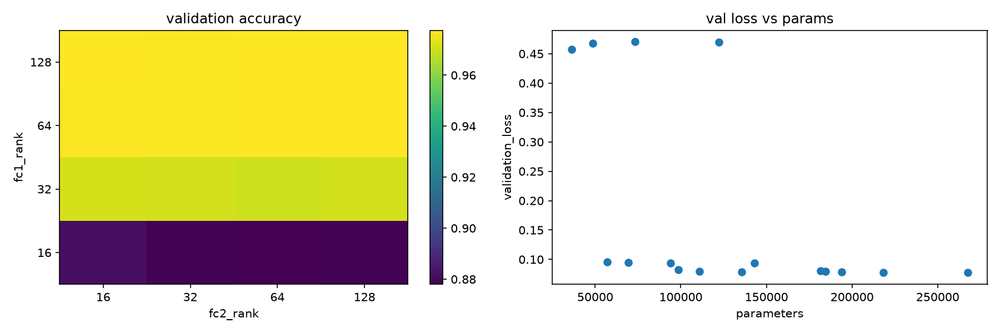
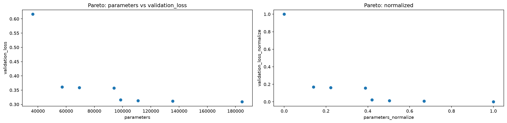
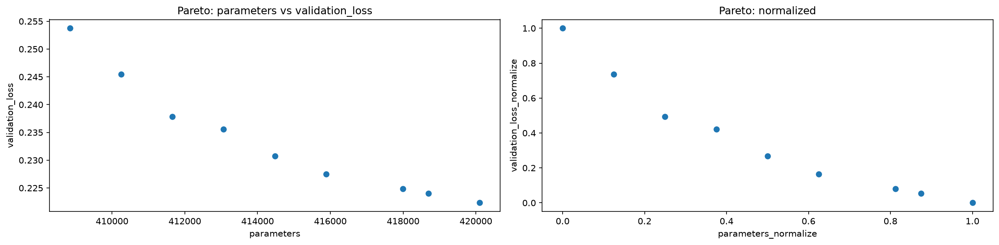
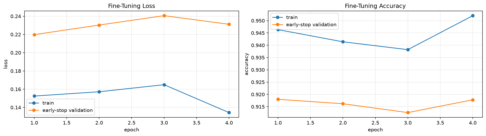

# 保存漏れ対応：独立した再実行の記録

run ID: `rerun_20260912T074153Z`（2026-09-12）。

監査で不足していた同一runのbaseline重み・全rankの丸め前の値・FT各epoch履歴・測定条件を、新しい5本のNotebookで取得した。全コードセルの実行が完了し、エラー出力は0件だった。過去runの欠落値を復元したものではない。従来のNotebook・results・modelsは上書きせず、CIFAR-10/Tuckerの再学習も行っていない。

命名整理：実行後に5 Notebookと対応するresults/modelsディレクトリを日時なしの `_rerun` 名へ統一した。run IDは維持し、途中出力の旧パスと実行時のコードhashは履歴として保持する。学習・評価の再実行や数値変更はしていない。現在の参照先は以下のリンクと各manifestを参照。

## 保存したものと検証

- 5 runすべてに `baseline_same_run.pt` / `final_same_run.pt` を保存。FT実施runでは全候補の最良重みも保存した。
- baseline全62 epochとFT全10候補・計65 epochのloss/accuracyをCSVへ保存。FT未実施のMNISTにFT履歴は作らない。
- rank sweep全70候補と、同時圧縮の固定rank 1構成を保存。全rankの指標を直接CSV出力し、画面表示の丸め値から作らない。
- raw CSV 68本、画像13枚、checkpoint 25本。実行済みNotebookの途中出力と既存の説明・コメントも保持した。
- `run_manifest.json` に最良epoch、test値、測定条件、GPU/torch環境、CSV/PNG/checkpointのhashを記録。
- `configuration_snapshot.json` に実行Notebookから読み取った段階別設定、分割件数、各ライブラリの版、Git HEAD、src/dataのhashを補足した。これは実行後の設定抽出であり追加学習ではない。
- baseline/FTの各履歴からEarly Stoppingを再計算し、最良epoch/lossと一致することを確認。パラメータ数、MACs、削減率、Paretoの前処理と最終rank選択も検証した。
- 保存したbaseline/final計10モデルを別プロセスで読み直し、各10,000件のtest loss/accuracyが保存値と一致することを確認した。
- 元5 Notebookのhashは複製時と一致。元の説明・数式・学習/評価処理も、出力先と進捗ログを除いて同一だった。旧runの保存成果物76個のhashも一致した。

検証の数値記録は [run_validation.json](run_validation.json) を参照。単体テスト一式や、対象外NotebookのRun Allは実行していない。commit/pushは行っていない。

## 維持した条件と数値の読み方

全runでSEED=0、train / Early Stopping validation / rankまたは最終validation / testは50,000 / 5,000 / 5,000 / 10,000件。学習とrank選択を分け、testは最終選択後に評価する。

- MNIST MLP：Adam、学習率0.001、最大5 epoch、patience=5。
- Fashion-MNIST MLP：baseline/FTともAdam、学習率0.001、最大50 epoch、patience=5。
- Fashion-MNIST CNN：baselineはAdam、学習率0.001、最大30 epoch。FTは学習率0.0003、最大30 epoch、patience=3。
- すべてmin_delta=0.0001。最良重みは `best_loss - min_delta > current_loss` の判定に従うため、単純なloss最小行と必ずしも同じではない。

最終モデルの時間は同じ入力をbaseline/finalへ渡して3試行し、各試行内の平均forward時間（ms/batch）の中央値を示す。H2D転送とDataLoaderの時間は含まない。CUDA同期あり、eval/no_grad、warmup=20。MNISTはrepeats=200・batch=64、Fashion-MNIST MLPは2000・64、CNNは2000・256。異なるbatchの時間を横並びで比較しない。rank sweep時の時間はFT前であり、最終モデルの時間とは別測定である。

MACsの集計範囲も元Notebookのまま保持した。MNIST/Fashion-MNIST MLPはMLP全体、CNN Linear単独はfc1/fc2のみ、CNN Conv単独はconv2のみ、同時圧縮はCNN全体。単独実験の削減率をCNN全体の削減率と読まない。パラメータ数と最終benchmarkは各モデル全体の値である。

以下の表示は要約のため丸めている。分析には各runのraw CSVを使う。圧縮によりパラメータが減っても、このGPUで必ず高速になるわけではない。また、1 seedの結果から統計的な精度改善を主張しない。

## 1. MNIST MLP

[実行済みNotebook](../../../notebooks/10_svd/10_mnist_mlp/02_rank_accuracy_tradeoff_corrected_rerun.ipynb) ／ [複製元Notebook](../../../notebooks/10_svd/10_mnist_mlp/02_rank_accuracy_tradeoff_corrected.ipynb)

- rank評価：16構成。baseline 5 epoch。FTなし。
- 最終構成：fc1_rank=128 / fc2_rank=128。
- test accuracy：98.17% → 98.08%。test loss：0.065442 → 0.065758。
- パラメータ数：535,818 → 267,530。
- 最終benchmark中央値：baseline 0.119641 → final 0.195747 ms/batch。
- [全rankの指標](../10_mnist_mlp/02_rank_accuracy_tradeoff_corrected_rerun/rank_sweep_validation.csv)、[baseline履歴](../10_mnist_mlp/02_rank_accuracy_tradeoff_corrected_rerun/baseline_history.csv)、[fit要約](../10_mnist_mlp/02_rank_accuracy_tradeoff_corrected_rerun/fit_summary.csv)、[test比較](../10_mnist_mlp/02_rank_accuracy_tradeoff_corrected_rerun/test_comparison.csv)、[最終benchmark](../10_mnist_mlp/02_rank_accuracy_tradeoff_corrected_rerun/final_model_benchmark.csv)。
- [baseline重み](../../../models/10_svd/10_mnist_mlp/02_rank_accuracy_tradeoff_corrected_rerun/baseline_same_run.pt)、[最終重み](../../../models/10_svd/10_mnist_mlp/02_rank_accuracy_tradeoff_corrected_rerun/final_same_run.pt)、[manifest](../10_mnist_mlp/02_rank_accuracy_tradeoff_corrected_rerun/run_manifest.json)、[設定snapshot](../10_mnist_mlp/02_rank_accuracy_tradeoff_corrected_rerun/configuration_snapshot.json)。

## 2. Fashion-MNIST MLP

[実行済みNotebook](../../../notebooks/10_svd/20_fashion_mnist_mlp/03_mlp_svd_finetuning_using_src_corrected_rerun.ipynb) ／ [複製元Notebook](../../../notebooks/10_svd/20_fashion_mnist_mlp/03_mlp_svd_finetuning_using_src_corrected.ipynb)

- rank評価：30構成。baseline 12 epoch。FT 3候補・合計31 epoch。
- 最終構成：fc1_rank=32 / fc2_rank=16。
- test accuracy：88.19% → 88.53%。test loss：0.329024 → 0.333776。
- パラメータ数：535,818 → 57,098。
- 最終benchmark中央値：baseline 0.137408 → final 0.197880 ms/batch。
- [全rankの指標](../20_fashion_mnist_mlp/03_mlp_svd_finetuning_using_src_corrected_rerun/rank_sweep_results.csv)、[baseline履歴](../20_fashion_mnist_mlp/03_mlp_svd_finetuning_using_src_corrected_rerun/baseline_history.csv)、[全FT履歴](../20_fashion_mnist_mlp/03_mlp_svd_finetuning_using_src_corrected_rerun/all_fine_tuning_history.csv)、[fit要約](../20_fashion_mnist_mlp/03_mlp_svd_finetuning_using_src_corrected_rerun/fit_summary.csv)、[test比較](../20_fashion_mnist_mlp/03_mlp_svd_finetuning_using_src_corrected_rerun/test_comparison.csv)、[最終benchmark](../20_fashion_mnist_mlp/03_mlp_svd_finetuning_using_src_corrected_rerun/final_model_benchmark.csv)。
- [baseline重み](../../../models/10_svd/20_fashion_mnist_mlp/03_mlp_svd_finetuning_using_src_corrected_rerun/baseline_same_run.pt)、[最終重み](../../../models/10_svd/20_fashion_mnist_mlp/03_mlp_svd_finetuning_using_src_corrected_rerun/final_same_run.pt)、[manifest](../20_fashion_mnist_mlp/03_mlp_svd_finetuning_using_src_corrected_rerun/run_manifest.json)、[設定snapshot](../20_fashion_mnist_mlp/03_mlp_svd_finetuning_using_src_corrected_rerun/configuration_snapshot.json)。

## 3. Fashion-MNIST CNN：Linear圧縮

[実行済みNotebook](../../../notebooks/10_svd/30_fashion_mnist_cnn/03_cnn_linear_svd_finetuning_rerun.ipynb) ／ [複製元Notebook](../../../notebooks/10_svd/30_fashion_mnist_cnn/03_cnn_linear_svd_finetuning.ipynb)

- rank評価：14構成。baseline 15 epoch。FT 3候補・合計12 epoch。
- 最終構成：fc1_rank=28。
- test accuracy：91.28% → 91.49%。test loss：0.238263 → 0.234693。
- パラメータ数：421,642 → 111,626。
- 最終benchmark中央値：baseline 0.346254 → final 0.338586 ms/batch。
- [全rankの指標](../30_fashion_mnist_cnn/03_cnn_linear_svd_finetuning_rerun/rank_sweep_results.csv)、[baseline履歴](../30_fashion_mnist_cnn/03_cnn_linear_svd_finetuning_rerun/baseline_history.csv)、[全FT履歴](../30_fashion_mnist_cnn/03_cnn_linear_svd_finetuning_rerun/all_fine_tuning_history.csv)、[fit要約](../30_fashion_mnist_cnn/03_cnn_linear_svd_finetuning_rerun/fit_summary.csv)、[test比較](../30_fashion_mnist_cnn/03_cnn_linear_svd_finetuning_rerun/test_comparison.csv)、[最終benchmark](../30_fashion_mnist_cnn/03_cnn_linear_svd_finetuning_rerun/final_model_benchmark.csv)。
- [baseline重み](../../../models/10_svd/30_fashion_mnist_cnn/03_cnn_linear_svd_finetuning_rerun/baseline_same_run.pt)、[最終重み](../../../models/10_svd/30_fashion_mnist_cnn/03_cnn_linear_svd_finetuning_rerun/final_same_run.pt)、[manifest](../30_fashion_mnist_cnn/03_cnn_linear_svd_finetuning_rerun/run_manifest.json)、[設定snapshot](../30_fashion_mnist_cnn/03_cnn_linear_svd_finetuning_rerun/configuration_snapshot.json)。

## 4. Fashion-MNIST CNN：Conv圧縮

[実行済みNotebook](../../../notebooks/10_svd/30_fashion_mnist_cnn/04_cnn_conv_svd_corrected_rerun.ipynb) ／ [複製元Notebook](../../../notebooks/10_svd/30_fashion_mnist_cnn/04_cnn_conv_svd_corrected.ipynb)

- rank評価：10構成。baseline 15 epoch。FT 3候補・合計18 epoch。
- 最終構成：conv2_rank=28。
- test accuracy：91.28% → 91.75%。test loss：0.238263 → 0.232226。
- パラメータ数：421,642 → 413,066。
- 最終benchmark中央値：baseline 0.344271 → final 0.353625 ms/batch。
- [全rankの指標](../30_fashion_mnist_cnn/04_cnn_conv_svd_corrected_rerun/rank_sweep_results.csv)、[baseline履歴](../30_fashion_mnist_cnn/04_cnn_conv_svd_corrected_rerun/baseline_history.csv)、[全FT履歴](../30_fashion_mnist_cnn/04_cnn_conv_svd_corrected_rerun/all_fine_tuning_history.csv)、[fit要約](../30_fashion_mnist_cnn/04_cnn_conv_svd_corrected_rerun/fit_summary.csv)、[test比較](../30_fashion_mnist_cnn/04_cnn_conv_svd_corrected_rerun/test_comparison.csv)、[最終benchmark](../30_fashion_mnist_cnn/04_cnn_conv_svd_corrected_rerun/final_model_benchmark.csv)。
- [baseline重み](../../../models/10_svd/30_fashion_mnist_cnn/04_cnn_conv_svd_corrected_rerun/baseline_same_run.pt)、[最終重み](../../../models/10_svd/30_fashion_mnist_cnn/04_cnn_conv_svd_corrected_rerun/final_same_run.pt)、[manifest](../30_fashion_mnist_cnn/04_cnn_conv_svd_corrected_rerun/run_manifest.json)、[設定snapshot](../30_fashion_mnist_cnn/04_cnn_conv_svd_corrected_rerun/configuration_snapshot.json)。

## 5. Fashion-MNIST CNN：Conv＋Linear同時圧縮

[実行済みNotebook](../../../notebooks/10_svd/30_fashion_mnist_cnn/05_cnn_conv_linear_svd_corrected_rerun.ipynb) ／ [複製元Notebook](../../../notebooks/10_svd/30_fashion_mnist_cnn/05_cnn_conv_linear_svd_corrected.ipynb)

- rank評価：1構成（固定rank。今回はsweep/再選択なし）。baseline 15 epoch。FT 1候補・合計4 epoch。
- 最終構成：fc1_rank=24 / conv2_rank=28。
- test accuracy：91.28% → 91.33%。test loss：0.238263 → 0.241242。
- パラメータ数：421,642 → 89,994。
- 最終benchmark中央値：baseline 0.346444 → final 0.383861 ms/batch。
- [全rankの指標](../30_fashion_mnist_cnn/05_cnn_conv_linear_svd_corrected_rerun/compression_summary.csv)、[baseline履歴](../30_fashion_mnist_cnn/05_cnn_conv_linear_svd_corrected_rerun/baseline_history.csv)、[全FT履歴](../30_fashion_mnist_cnn/05_cnn_conv_linear_svd_corrected_rerun/all_fine_tuning_history.csv)、[fit要約](../30_fashion_mnist_cnn/05_cnn_conv_linear_svd_corrected_rerun/fit_summary.csv)、[test比較](../30_fashion_mnist_cnn/05_cnn_conv_linear_svd_corrected_rerun/test_comparison.csv)、[最終benchmark](../30_fashion_mnist_cnn/05_cnn_conv_linear_svd_corrected_rerun/final_model_benchmark.csv)。
- [baseline重み](../../../models/10_svd/30_fashion_mnist_cnn/05_cnn_conv_linear_svd_corrected_rerun/baseline_same_run.pt)、[最終重み](../../../models/10_svd/30_fashion_mnist_cnn/05_cnn_conv_linear_svd_corrected_rerun/final_same_run.pt)、[manifest](../30_fashion_mnist_cnn/05_cnn_conv_linear_svd_corrected_rerun/run_manifest.json)、[設定snapshot](../30_fashion_mnist_cnn/05_cnn_conv_linear_svd_corrected_rerun/configuration_snapshot.json)。

## 過去runとの区別と保存の範囲

CNN Linear単独の新規runではfc1=28が選ばれた。従来docsのfc1=24を示す数値・図とは別の結果であり、自動的に置き換えていない。同時圧縮runは元の固定条件conv2=28・fc1=24を維持したため、今回の単独実験のrankを組み合わせ直した実験ではない。

過去runのbaseline未保存・丸め前の値の欠落という制約は依然として過去runに残る。完全な記録を用いる場合は、この新規runのNotebook・CSV・画像・重みを一式で使い、過去runの図や別runのbaselineを混ぜない。

ここで「完全保存」と呼ぶ範囲は、監査で指摘した評価記録と最良重みの不足を解消すること。checkpointはmodelのstate_dictであり、各epochのoptimizer/RNG状態まで保持した学習再開用checkpointではない。全rankとは評価指標全行のことで、全rankの圧縮直後重みをすべて保存したという意味ではない。
